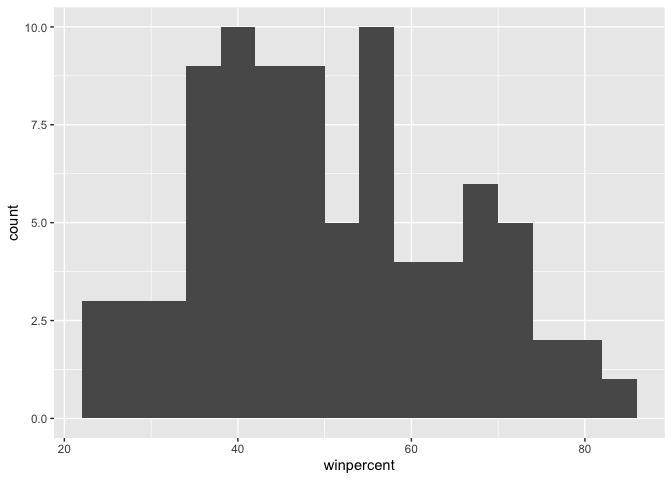
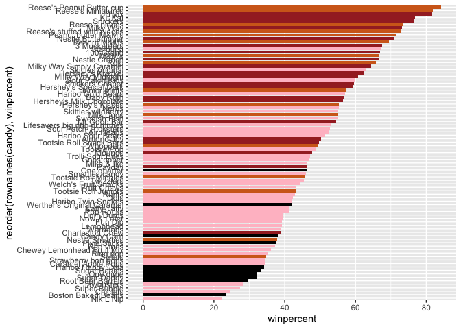
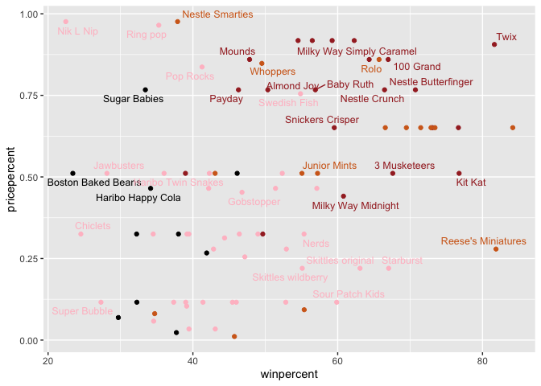
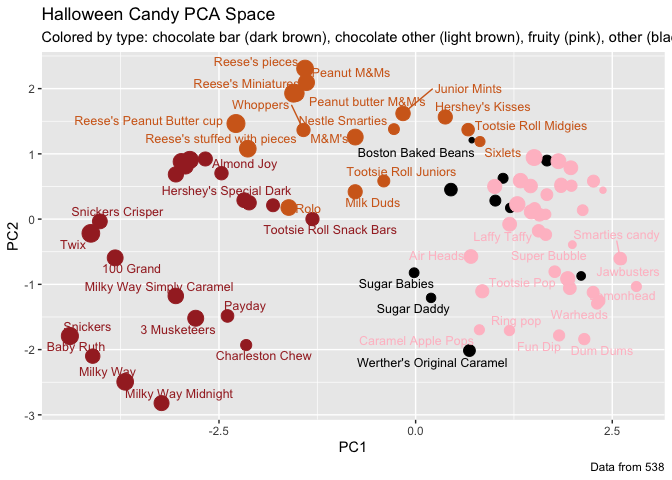
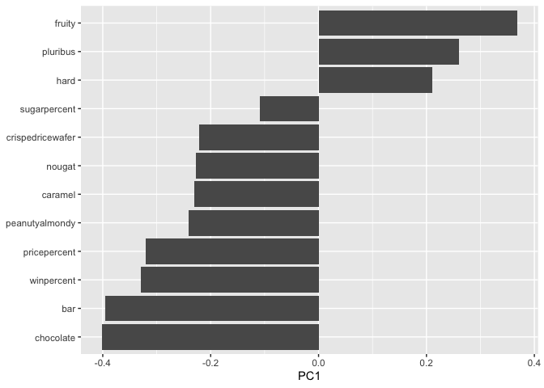

# Class 09 Mini Project
Harshita Jha (PID: A17350910)

- [Background](#background)
- [2. Importing Candy Data](#2-importing-candy-data)
  - [2.1 What is in this data set?](#21-what-is-in-this-data-set)
  - [2.2 What is your favorite candy?](#22-what-is-your-favorite-candy)
  - [**Side Note** - the skimr::skim()
    function](#side-note---the-skimrskim-function)
- [3. Exploratory Analysis](#3-exploratory-analysis)
- [4. Overall Candy Rankings](#4-overall-candy-rankings)
  - [Time to Add some useful color](#time-to-add-some-useful-color)
- [Taking a look at Price point](#taking-a-look-at-price-point)
- [6. Exploring the correlation
  structure](#6-exploring-the-correlation-structure)
- [7. Principal Component Analysis](#7-principal-component-analysis)
- [8. Summary](#8-summary)

## Background

In this mini-project, we will explore FiveThirtyEight’s Halloween Candy
data set.

We will use lots of **ggplots**, some basic stats, correlation analysis
and PCA to make sense of the landscape of US candy. The task for this
**Candy mini project** is to explore a candy dataset to find out answers
to these types of questions like ‘So what is the top ranked snack-sized
Halloween candy? What made some candies more desirable than others? Was
it price? Maybe it was just sugar content? Were they chocolate? Did they
contain peanuts or almonds?’ but most of all the job is to have fun,
learn by doing hands on data analysis, and hopefully make this type of
analysis less frightening for the future! Let’s get started.

## 2. Importing Candy Data

``` r
candy_file <- "candy-data.csv"
candy = read.csv("candy-data.csv", row.names=1)
head(candy)
```

                 chocolate fruity caramel peanutyalmondy nougat crispedricewafer
    100 Grand            1      0       1              0      0                1
    3 Musketeers         1      0       0              0      1                0
    One dime             0      0       0              0      0                0
    One quarter          0      0       0              0      0                0
    Air Heads            0      1       0              0      0                0
    Almond Joy           1      0       0              1      0                0
                 hard bar pluribus sugarpercent pricepercent winpercent
    100 Grand       0   1        0        0.732        0.860   66.97173
    3 Musketeers    0   1        0        0.604        0.511   67.60294
    One dime        0   0        0        0.011        0.116   32.26109
    One quarter     0   0        0        0.011        0.511   46.11650
    Air Heads       0   0        0        0.906        0.511   52.34146
    Almond Joy      0   1        0        0.465        0.767   50.34755

### 2.1 What is in this data set?

According to 538 the columns in the dataset include:

- chocolate: Does it contain chocolate?
- fruity: Is it fruit flavored?
- caramel: Is there caramel in the candy?
- peanutyalmondy: Does it contain peanuts, peanut butter or almonds?
- nougat: Does it contain nougat?
- crispedricewafer: Does it contain crisped rice, wafers, or a cookie
  component?
- hard: Is it a hard candy?
- bar: Is it a candy bar?
- pluribus: Is it one of many candies in a bag or box?
- sugarpercent: The percentile of sugar it falls under within the data
  set.
- pricepercent: The unit price percentile compared to the rest of the
  set.
- winpercent: The overall win percentage according to 269,000 matchups
  (more on this in a moment).

> Q1. How many different candy types are in this dataset?

``` r
nrow(candy)
```

    [1] 85

- There are 85 different candy types in this data set.

> Q2. How many fruity candy types are in the dataset?

``` r
sum(candy$fruity)
```

    [1] 38

- There are 38 fruity candy types in the data set.

### 2.2 What is your favorite candy?

We can find the winpercent value for Twix by using its name to access
the corresponding row of the dataset. This is because the dataset has
each candy name as rownames (recall that we set this when we imported
the original CSV file). For example the code for Twix is:

``` r
candy["Twix", ]$winpercent
```

    [1] 81.64291

An alternate way to do this is with the help of the dplyr package that
we have seen previously:

``` r
library(dplyr)
```


    Attaching package: 'dplyr'

    The following objects are masked from 'package:stats':

        filter, lag

    The following objects are masked from 'package:base':

        intersect, setdiff, setequal, union

``` r
candy |> 
  filter(row.names(candy)=="Twix") |> 
  select(winpercent)
```

         winpercent
    Twix   81.64291

> Q3. What is your favorite candy (other than Twix) in the dataset and
> what is it’s winpercent value?

``` r
candy["Snickers", ]$winpercent
```

    [1] 76.67378

- The winpercent for Snickers is 76.67378.

> Q4. What is the winpercent value for “Kit Kat”?

``` r
candy["Kit Kat", ]$winpercent
```

    [1] 76.7686

- The winpercent value for Kitkat is 76.7686.

> Q5. What is the winpercent value for “Tootsie Roll Snack Bars”?

``` r
candy["Tootsie Roll Snack Bars", ]$winpercent
```

    [1] 49.6535

- The winpercent is 49.6535.

### **Side Note** - the skimr::skim() function

There is a useful skim() function in the skimr package that can help
give you a quick overview of a given dataset. Let’s install this package
and try it on our candy data.

- `Skimr()` needs to be installed first.

``` r
# install.packages("skimr")
library("skimr")
skim(candy)
```

|                                                  |       |
|:-------------------------------------------------|:------|
| Name                                             | candy |
| Number of rows                                   | 85    |
| Number of columns                                | 12    |
| \_\_\_\_\_\_\_\_\_\_\_\_\_\_\_\_\_\_\_\_\_\_\_   |       |
| Column type frequency:                           |       |
| numeric                                          | 12    |
| \_\_\_\_\_\_\_\_\_\_\_\_\_\_\_\_\_\_\_\_\_\_\_\_ |       |
| Group variables                                  | None  |

Data summary

**Variable type: numeric**

| skim_variable | n_missing | complete_rate | mean | sd | p0 | p25 | p50 | p75 | p100 | hist |
|:---|---:|---:|---:|---:|---:|---:|---:|---:|---:|:---|
| chocolate | 0 | 1 | 0.44 | 0.50 | 0.00 | 0.00 | 0.00 | 1.00 | 1.00 | ▇▁▁▁▆ |
| fruity | 0 | 1 | 0.45 | 0.50 | 0.00 | 0.00 | 0.00 | 1.00 | 1.00 | ▇▁▁▁▆ |
| caramel | 0 | 1 | 0.16 | 0.37 | 0.00 | 0.00 | 0.00 | 0.00 | 1.00 | ▇▁▁▁▂ |
| peanutyalmondy | 0 | 1 | 0.16 | 0.37 | 0.00 | 0.00 | 0.00 | 0.00 | 1.00 | ▇▁▁▁▂ |
| nougat | 0 | 1 | 0.08 | 0.28 | 0.00 | 0.00 | 0.00 | 0.00 | 1.00 | ▇▁▁▁▁ |
| crispedricewafer | 0 | 1 | 0.08 | 0.28 | 0.00 | 0.00 | 0.00 | 0.00 | 1.00 | ▇▁▁▁▁ |
| hard | 0 | 1 | 0.18 | 0.38 | 0.00 | 0.00 | 0.00 | 0.00 | 1.00 | ▇▁▁▁▂ |
| bar | 0 | 1 | 0.25 | 0.43 | 0.00 | 0.00 | 0.00 | 0.00 | 1.00 | ▇▁▁▁▂ |
| pluribus | 0 | 1 | 0.52 | 0.50 | 0.00 | 0.00 | 1.00 | 1.00 | 1.00 | ▇▁▁▁▇ |
| sugarpercent | 0 | 1 | 0.48 | 0.28 | 0.01 | 0.22 | 0.47 | 0.73 | 0.99 | ▇▇▇▇▆ |
| pricepercent | 0 | 1 | 0.47 | 0.29 | 0.01 | 0.26 | 0.47 | 0.65 | 0.98 | ▇▇▇▇▆ |
| winpercent | 0 | 1 | 50.32 | 14.71 | 22.45 | 39.14 | 47.83 | 59.86 | 84.18 | ▃▇▆▅▂ |

> Q6. Is there any variable/column that looks to be on a different scale
> to the majority of the other columns in the dataset?

- Yes, the `winpercent` column looks to be on a different scale to the
  majority of the other columns in the data set.

> Q7. What do you think a zero and one represent for the
> candy\$chocolate column?

- The zero and one represent if the candy contains chocolate or not. 0
  is for if the candy does not contain chocolate and 1 is for if the
  candy does contain chocolate.

## 3. Exploratory Analysis

A good place to start any exploratory analysis is with a histogram. You
can do this most easily with the base R function hist(). Alternatively,
you can use ggplot() with geom_hist(). Either works well in this case
and (as always) its your choice.

> Q8. Plot a histogram of winpercent values using both base R and ggplot
> functions.

``` r
hist(candy$winpercent)
```


``` r
library(ggplot2)
ggplot(candy, aes(winpercent)) + 
  geom_histogram(binwidth = 4)
```



> Q9. Is the distribution of winpercent values symmetrical?

- No, from the histograms we can see that the distribution of winpercent
  values is not symmetrical.

> Q10. Is the center of the distribution above or below 50%?

``` r
mean(candy$winpercent)
```

    [1] 50.31676

``` r
summary(candy$winpercent)
```

       Min. 1st Qu.  Median    Mean 3rd Qu.    Max. 
      22.45   39.14   47.83   50.32   59.86   84.18 

- The mean of the distribution was above 50% but the median was actually
  below 50.

> Q11. On average is chocolate candy higher or lower ranked than fruit
> candy?

``` r
mean(candy$winpercent[as.logical(candy$chocolate)]) >
mean(candy$winpercent[as.logical(candy$fruity)])
```

    [1] TRUE

- Yes, on average chocolate candy is higher ranked than fruit candy.

> Q12. Is this difference statistically significant?

``` r
chocolate <- candy$winpercent[as.logical(candy$chocolate)]
fruit <- candy$winpercent[as.logical(candy$fruity)]
t.test(chocolate ,fruit)
```


        Welch Two Sample t-test

    data:  chocolate and fruit
    t = 6.2582, df = 68.882, p-value = 2.871e-08
    alternative hypothesis: true difference in means is not equal to 0
    95 percent confidence interval:
     11.44563 22.15795
    sample estimates:
    mean of x mean of y 
     60.92153  44.11974 

- Yes, based on the t-test values the difference is statistically
  significant.

## 4. Overall Candy Rankings

Let’s use the base R order() function together with head() to sort the
whole dataset by winpercent. Or if you have been getting into the
tidyverse and the dplyr package you can use the arrange() function
together with head() to do the same thing and answer the following
questions:

> Q13. What are the five least liked candy types in this set?

``` r
candy |> arrange(winpercent) |> head(5)
```

                       chocolate fruity caramel peanutyalmondy nougat
    Nik L Nip                  0      1       0              0      0
    Boston Baked Beans         0      0       0              1      0
    Chiclets                   0      1       0              0      0
    Super Bubble               0      1       0              0      0
    Jawbusters                 0      1       0              0      0
                       crispedricewafer hard bar pluribus sugarpercent pricepercent
    Nik L Nip                         0    0   0        1        0.197        0.976
    Boston Baked Beans                0    0   0        1        0.313        0.511
    Chiclets                          0    0   0        1        0.046        0.325
    Super Bubble                      0    0   0        0        0.162        0.116
    Jawbusters                        0    1   0        1        0.093        0.511
                       winpercent
    Nik L Nip            22.44534
    Boston Baked Beans   23.41782
    Chiclets             24.52499
    Super Bubble         27.30386
    Jawbusters           28.12744

- The 5 least liked are `Nik L Nip`, `Boston Baked Beans`, `Chiclets`,
  `Super Bubble` and `Jawbusters`.

Q14. What are the top 5 all time favorite candy types out of this set?

``` r
candy |> arrange(desc(winpercent)) |> head(5)
```

                              chocolate fruity caramel peanutyalmondy nougat
    Reese's Peanut Butter cup         1      0       0              1      0
    Reese's Miniatures                1      0       0              1      0
    Twix                              1      0       1              0      0
    Kit Kat                           1      0       0              0      0
    Snickers                          1      0       1              1      1
                              crispedricewafer hard bar pluribus sugarpercent
    Reese's Peanut Butter cup                0    0   0        0        0.720
    Reese's Miniatures                       0    0   0        0        0.034
    Twix                                     1    0   1        0        0.546
    Kit Kat                                  1    0   1        0        0.313
    Snickers                                 0    0   1        0        0.546
                              pricepercent winpercent
    Reese's Peanut Butter cup        0.651   84.18029
    Reese's Miniatures               0.279   81.86626
    Twix                             0.906   81.64291
    Kit Kat                          0.511   76.76860
    Snickers                         0.651   76.67378

- The top 5 all time favorite candy types are
  `Reese's Peanut Butter cup`, `Reese's Miniatures`, `Twix`, `Kit Kat`
  and `Snickers`.

Now, let’s make a bar plot to visualize the overall rankings in a
step-wise fashion.

> Q15. Make a first barplot of candy ranking based on winpercent values.

``` r
library(ggplot2)
ggplot(candy) + aes(winpercent,rownames(candy)) + geom_col()
```


> Q16. This is quite ugly, use the reorder() function to get the bars
> sorted by winpercent?

``` r
ggplot(candy) + aes(winpercent, reorder(rownames(candy),winpercent)) + geom_col()
```


### Time to Add some useful color

We start by seting up a color vector (that signifies candy type) that we
can then use for some future plots. We start by making a vector of all
black values (one for each candy). Then we overwrite chocolate (for
chocolate candy), brown (for candy bars) and red (for fruity candy)
values.

``` r
my_cols=rep("black", nrow(candy))
my_cols[as.logical(candy$chocolate)] = "chocolate"
my_cols[as.logical(candy$bar)] = "brown"
my_cols[as.logical(candy$fruity)] = "pink"
```

Now let’s try our barplot with these colors:

``` r
ggplot(candy) + 
  aes(winpercent, reorder(rownames(candy),winpercent)) +
  geom_col(fill=my_cols) 
```



> Q17. What is the worst ranked chocolate candy?

- The worst ranked chocolate candy is `Sixlets`.

> Q18. What is the best ranked fruity candy?

- The best ranked fruity candy is `Starbust`.

## Taking a look at Price point

The **pricepercent** variable records the percentile rank of the candy’s
price against all the other candies in the dataset. **Lower values are
less expensive and higher values are more expensive**. In our ggplot, we
will use the `geom_text_repel()` function from the **ggrepel package**
to avoid overlapping labels which are hard to read.

``` r
library(ggrepel)
ggplot(candy) +
  aes(winpercent, pricepercent, label=rownames(candy)) +
  geom_point(col=my_cols) + 
  geom_text_repel(col=my_cols, size=3.3, max.overlaps = 5)
```

    Warning: ggrepel: 50 unlabeled data points (too many overlaps). Consider
    increasing max.overlaps



> Q19. Which candy type is the highest ranked in terms of `winpercent`
> for the least money - i.e. offers the most bang for your buck?

- `Reese's miniatures` is the candy type is the highest ranked in terms
  of `winpercent` for the least money - i.e. offers the most bang for
  your buck.

> Q20. What are the top 5 most expensive candy types in the dataset and
> of these which is the least popular?

``` r
ord <- order(candy$pricepercent, decreasing = TRUE)
head( candy[ord,c(11,12)], n=5 )
```

                             pricepercent winpercent
    Nik L Nip                       0.976   22.44534
    Nestle Smarties                 0.976   37.88719
    Ring pop                        0.965   35.29076
    Hershey's Krackel               0.918   62.28448
    Hershey's Milk Chocolate        0.918   56.49050

- The 5 most expensive candy types are given above and the least popular
  among these 5 is the `Nik L Nip` candy.

## 6. Exploring the correlation structure

We’ll use correlation and view the results with the corrplot package to
plot a correlation matrix.

``` r
library(corrplot)
```

    corrplot 0.95 loaded

``` r
cij <- cor(candy)
corrplot(cij)
```


> Q22. Examining this plot what two variables are anti-correlated
> (i.e. have minus values)?

- From this plot, we see that the two variables that are anti-correlated
  (i.e have minus values) are `chocolate` and `fruity`.

> Q23. Similarly, what two variables are most positively correlated?

- The two variables that are the most positively correlated are
  `chocolate` and `winpercent`.

## 7. Principal Component Analysis

Let’s apply PCA using the prcomp() function to our candy dataset
remembering to set the scale=TRUE argument.

``` r
pca <- prcomp(candy, scale= TRUE)
summary(pca)
```

    Importance of components:
                              PC1    PC2    PC3     PC4    PC5     PC6     PC7
    Standard deviation     2.0788 1.1378 1.1092 1.07533 0.9518 0.81923 0.81530
    Proportion of Variance 0.3601 0.1079 0.1025 0.09636 0.0755 0.05593 0.05539
    Cumulative Proportion  0.3601 0.4680 0.5705 0.66688 0.7424 0.79830 0.85369
                               PC8     PC9    PC10    PC11    PC12
    Standard deviation     0.74530 0.67824 0.62349 0.43974 0.39760
    Proportion of Variance 0.04629 0.03833 0.03239 0.01611 0.01317
    Cumulative Proportion  0.89998 0.93832 0.97071 0.98683 1.00000

Now, we plot our main PCA score plot of PC1 vs PC2:

``` r
plot(pca$x[,1:2])
```


Changing the plotting color and adding some color:

``` r
plot(pca$x[,1:2], col=my_cols, pch=16)
```


Making a new data-frame:

``` r
my_data <- cbind(candy, pca$x[,1:3])
```

``` r
p <- ggplot(my_data) + 
        aes(x=PC1, y=PC2, 
            size=winpercent/100,  
            text=rownames(my_data),
            label=rownames(my_data)) +
        geom_point(col=my_cols)

p
```


Again we can use the ggrepel package and the function
ggrepel::geom_text_repel() to label up the plot with non overlapping
candy names like. We will also add a title and subtitle like so:

``` r
library(ggrepel)

p + geom_text_repel(size=3.3, col=my_cols, max.overlaps = 7)  + 
  theme(legend.position = "none") +
  labs(title="Halloween Candy PCA Space",
       subtitle="Colored by type: chocolate bar (dark brown), chocolate other (light brown), fruity (pink), other (black)",
       caption="Data from 538")
```

    Warning: ggrepel: 39 unlabeled data points (too many overlaps). Consider
    increasing max.overlaps



``` r
# install.packages("plotly")
# library(plotly)
# ggplotly(p)
```

``` r
ggplot(pca$rotation) +
  aes(PC1, reorder(row.names(pca$rotation),PC1)) +
  geom_col() + 
  theme(axis.title.y = (element_blank()))
```



> Q24. Complete the code to generate the loadings plot above. What
> original variables are picked up strongly by PC1 in the positive
> direction? Do these make sense to you? Where did you see this
> relationship highlighted previously?

- The code is completed above to generate the plot above. The original
  variables that are picked up strongly by PC1 in the positive direction
  are `fruity`, `pluribus` and `hard`. Yes, this makes sense because it
  separates the two main different types of candies in the data
  set-candies with high PC1 scores which are fruity, pluribus and have a
  hard texture to the candies with negative PC1 scores that are
  chocolate and bar type. So, this plot captures the major split between
  the candy types.This relationship was highlighted previously in the
  correlation plot.

## 8. Summary

> Q25. Based on your exploratory analysis, correlation findings, and PCA
> results, what combination of characteristics appears to make a
> “winning” candy? How do these different analyses (visualization,
> correlation, PCA) support or complement each other in reaching this
> conclusion?

- Based on our exploratory analysis, correlation findings, and PCA
  results, the combination of characteristics that appears to make a
  “winning” candy is **chocolate bar type often with things like
  peanut/almond/nougat/caramel**. These different analyses
  (visualization, correlation, PCA) support/complement each other in
  reaching this conclusion as the plots including the ggplots produced
  consistently show the highest popularity (winpercent) for chocolate
  bar type of candy and low popularity of the fruity/pluribus/hard
  candy. The correlation plot also shows this result of the chocolate vs
  fruity being opposite and most vs least popular. Finally, the PCA
  brings all of the analysis together and gives us that clear split
  between the two main candy types- the chocolate bar type vs the fruity
  candy.
