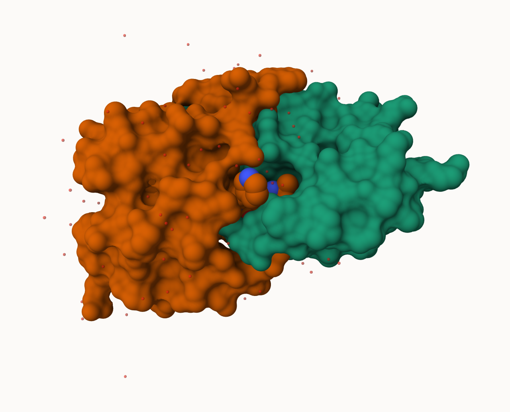
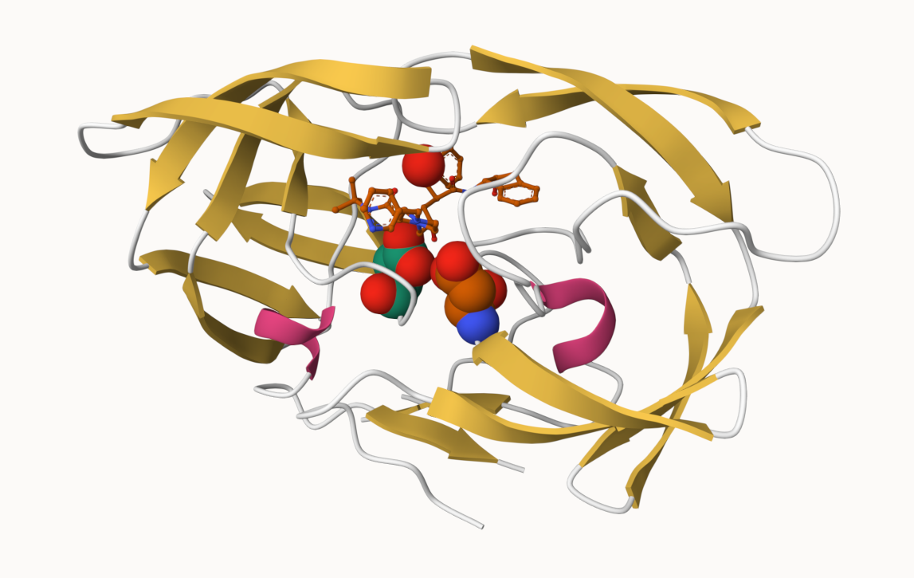

## PDB Statistics

The Protein Data Bank (PDB) is the main repository of biomolecular structures. Let's see what is contains: 


```{r}
stats1 <- read.csv("Data Export Summary.csv")
```

```{r}
stats1$X.ray
```

The comma in the numbers leads to the numbers here being read as a character. 

```{r}
# install.packages("readr")
library(readr)
stats <- read_csv("Data Export Summary.csv")
stats
```

```{r}
n.xray <- sum(stats$`X-ray`)
n.em <- sum(stats$EM)
n.total <- sum(stats$Total)

xray_perc <- n.xray/n.total*100
em_perc <- n.em/n.total*100

sum(xray_perc, em_perc)
```


> Q1: What percentage of structures in the PDB are solved by X-Ray and Electron Microscopy.

- 93.7892 percent of structures in the PDB are solved by X-Ray and Electron Microscopy

> Q2: What proportion of structures in the PDB are protein?

```{r}
protein_total <- sum(stats$Total[1:3])
total_structures <- sum(stats$Total)
protein_total/total_structures
```
- 0.979118 is the proportion of structures in PDB that are proteins.

> Q3: Type HIV in the PDB website search box on the home page and determine how many HIV-1 protease structures are in the current PDB?

- SKIP...looking up HIV structures including 1HSG

## Visualising the HIV-1 protease structure

We can use the Molstar viewer online:  https://molstar.org/viewer/

 

> Q6: Generate and save a figure clearly showing the two distinct chains of HIV-protease along with the ligand. You might also consider showing the catalytic residues ASP 25 in each chain and the critical water (we recommend “Ball & Stick” for these side-chains). Add this figure to your Quarto document.

- A new clean image showing the catalytic ASP25 amino acids in both chains of the HIV-PR dimer along with the inhibitor and the all important active site water. 

 

## Bio3D package for structural bioinformatics

```{r}
library(bio3d)

pdb <- read.pdb("1hsg")
pdb
```

```{r}
head(pdb$atom)
```

```{r}
# install.packages("pak")
# pak::pak("bioboot/bio3dview")
# install.packages("NGLVieweR")
```

```{r}
library(bio3dview)

view.pdb(pdb)
```


```{r}
library(bio3dview)
library(NGLVieweR)

view.pdb(pdb) |>
  setSpin()
# Select the important ASP 25 residue
sele <- atom.select(pdb, resno=25)

# and highlight them in spacefill representation
view.pdb(pdb, cols=c("navy","teal"), 
         highlight = sele,
         highlight.style = "spacefill") |> setRock()
```

