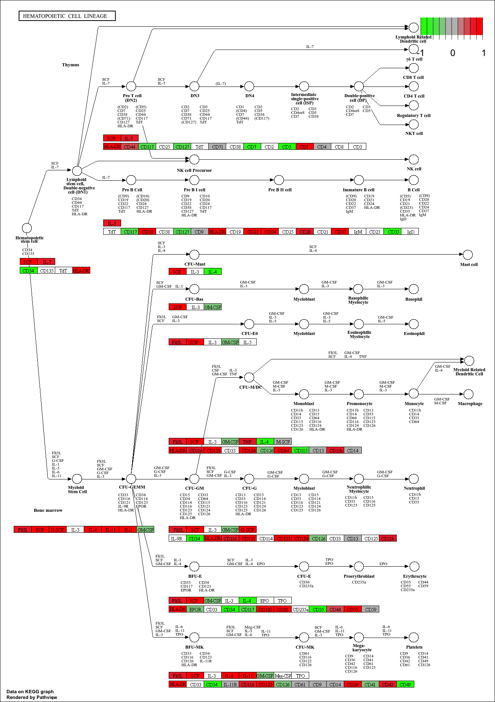
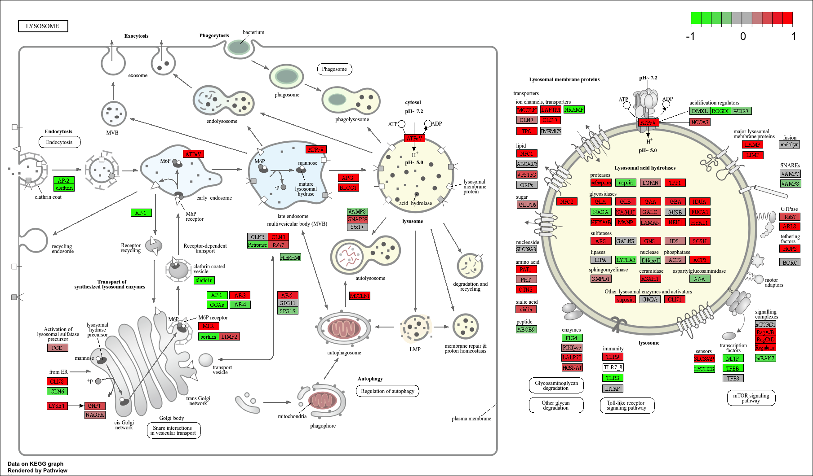
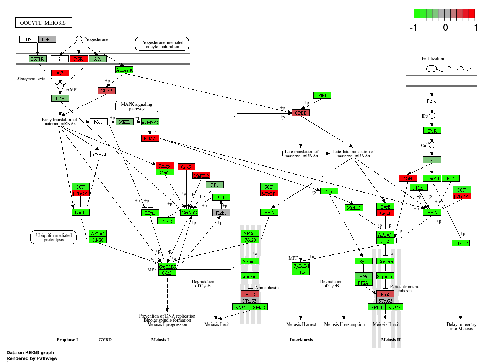

## Background

Our data for today comes from HOX gene knowck-out study.

The authors report on differential analysis of lung fibroblasts in response to loss of the developemnetal transcription factor HOXA1

## Differential Expression Analysis

### Data Import 

- First step is to download the count data and associated meta data into our document. 

```{r, message=FALSE}
library(DESeq2)
```

- Now load our data: 

```{r}
metaFile <- "GSE37704_metadata.csv"
countFile <- "GSE37704_featurecounts.csv"

```

```{r}
colData = read.csv(metaFile, row.names=1)
head(colData)
```


```{r}
countData = read.csv(countFile, row.names=1)
head(countData)
```

> Q. Complete the code below to remove the troublesome first column from countData

```{r}
countData <- as.matrix(countData[,-1])
head(countData)
```

- Now let's get rid of the zero entries. We should remove these before any further analysis. 

> Q. Complete the code below to filter countData to exclude genes (i.e. rows) where we have 0 read count across all samples (i.e. columns).
Tip: What will rowSums() of countData return and how could you use it in this context?

```{r}
countData = countData[rowSums(countData) >0, ]
head(countData)
```

- Now, run the DESeq2:

```{r}
dds <- DESeqDataSetFromMatrix(countData=countData,
                             colData=colData,
                             design=~condition)
dds <- DESeq(dds)
dds
```
```{r}
res <- results(dds)
```

```{r}
summary(res)
```

### Volcano Plot

Now, we will make a volcano plot of log2 fold change vs -log adjusted p-value.

```{r}
library(ggplot2)
```

```{r}
ggplot(res) +
  aes(log2FoldChange,
      -log(padj)) +
  geom_point()
```

> Q. Improve this plot by completing the below code, which adds color, axis labels and cutoff lines:

```{r}
# Make a color vector for all genes
mycols <- rep("gray", nrow(res) )

# Color blue the genes with fold change above 2
mycols[ abs(res$log2FoldChange) > 2 ] <- "blue"

# Color gray those with adjusted p-value more than 0.01
mycols[ res$padj > 0.01 ] <- "gray"

ggplot(res) +
  aes(log2FoldChange,
       -log(padj)) +
  geom_point(color=mycols) +
  xlab("Log2(FoldChange)") +
  ylab("-Log(P-value)") +
  geom_vline(xintercept = c(-2,2)) +
  geom_hline(yintercept = -log(0.01))
```

### Adding gene annotation

> Q.Use the mapIDs() function multiple times to add SYMBOL, ENTREZID and GENENAME annotation to our results by completing the code below.

```{r}
library("AnnotationDbi")
library("org.Hs.eg.db")

columns(org.Hs.eg.db)

res$symbol = mapIds(org.Hs.eg.db,
                    keys=row.names(res), 
                    keytype="ENSEMBL",
                    column="SYMBOL",
                    multiVals="first")

res$entrez = mapIds(org.Hs.eg.db,
                    keys=row.names(res),
                    keytype="ENSEMBL",
                    column="ENTREZID",
                    multiVals="first")

res$name =   mapIds(org.Hs.eg.db,
                    keys=row.names(res),
                    keytype="ENSEMBL",
                    column="GENENAME",
                    multiVals="first")

head(res, 10)
```

> Q.Finally for this section let's reorder these results by adjusted p-value and save them to a CSV file in your current project directory.

```{r}
res <- res[order(res$pvalue),]
write.csv(res, file ="deseq_results.csv")
```


## Pathway Analysis

First we load up the packaged required and set up the KEGG data-sets we need: 

```{r, message=FALSE}
library(pathview)
library(gage)
library(gageData)

data(kegg.sets.hs)
data(sigmet.idx.hs)

# Focus on signaling and metabolic pathways only
kegg.sets.hs = kegg.sets.hs[sigmet.idx.hs]

# Examine the first 3 pathways
head(kegg.sets.hs, 3)

```

```{r}
foldchanges = res$log2FoldChange
names(foldchanges) = res$entrez
head(foldchanges)
```

- Now, we can run the **gage** pathway analysis:

```{r}
keggres = gage(foldchanges, gsets=kegg.sets.hs)
attributes(keggres)
```

- Now, we can look at the first few down pathways: 

```{r}
head(keggres$less)
```

- Pathway for the **cell cycle**:

```{r}
pathview(gene.data=foldchanges, pathway.id="hsa04110")

```


- Now, we can process our results more to automatically pull up the to 5 upregulated pathways then further process that just to get the pathway IDs needed by the pathview() function.

```{r}
## Focus on top 5 upregulated pathways here for demo purposes only
keggrespathways <- rownames(keggres$greater)[1:5]

# Extract the 8 character long IDs part of each string
keggresids = substr(keggrespathways, start=1, stop=8)
keggresids
```

```{r}
pathview(gene.data=foldchanges, pathway.id=keggresids, species="hsa")
```







> Q. Can you do the same procedure as above to plot the pathview figures for the top 5 down-regulated pathways?

```{r}
## Focus on top 5 down-regulated pathways
keggrespathways_down <- rownames(keggres$less)[1:5]

# Extract the 8 character long IDs part of each string
keggresids_down <- substr(keggrespathways, start=1, stop=8)
keggresids_down
```

```{r}
pathview(gene.data=foldchanges, pathway.id=keggresids_down, species="hsa")
```





## Gene Ontology

We can a similar procedure we did above but with gene ontology database. 

```{r}
data(go.sets.hs)
data(go.subs.hs)

# Focus on Biological Process subset of GO
gobpsets = go.sets.hs[go.subs.hs$BP]

gobpres = gage(foldchanges, gsets=gobpsets)

lapply(gobpres, head)
```


## Reactome Analysis

Now we do over-representation enrichment analysis and pathway-topology analysis with **Reactome database** using the previous list of significant genes generated from our differential expression results above.

```{r}
sig_genes <- res[res$padj <= 0.05 & !is.na(res$padj), "symbol"]
print(paste("Total number of significant genes:", length(sig_genes)))

```

```{r}
write.table(sig_genes, file="significant_genes.txt", row.names=FALSE, col.names=FALSE, quote=FALSE)
```


> Q: What pathway has the most significant “Entities p-value”? Do the most significant pathways listed match your previous KEGG results? What factors could cause differences between the two methods?

- The pathway that has the most significant "Entities p-value" is the mitotic phase of the cell cycle. The most significant pathways in the KEGG results were cell cycle, DNA replication, homologous recombination, oocyte meiosis etc while the most significant pathways in the Reactome analysis was Mitotic phase of cell cycle, cell cycle checkpoints, M-phase of mitosis etc.Thus, the most significant pathways in the KEGG results and Reactome results both are closely related to the cell cycle/division and therefore, they closely match. Some factors that could cause differences between the two methods were that KEGG and Reactome databases put the pathways together slightly differently with Reactome database dividing the data into more detailed sub-steps while KEGG results are more broad.  


