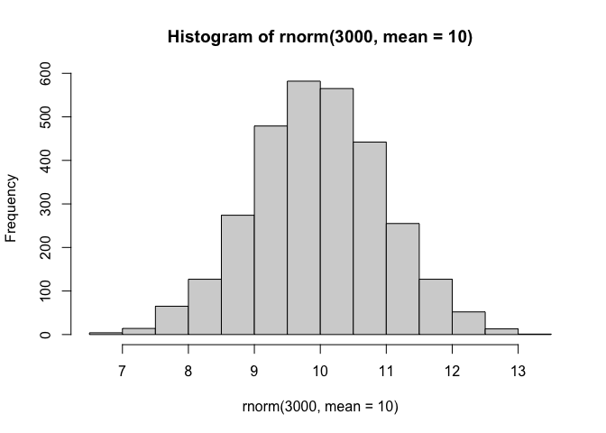
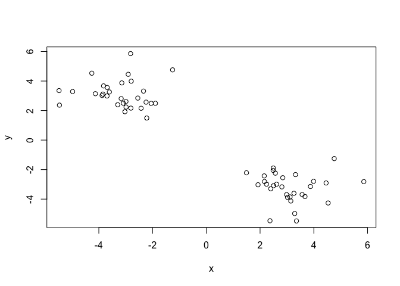
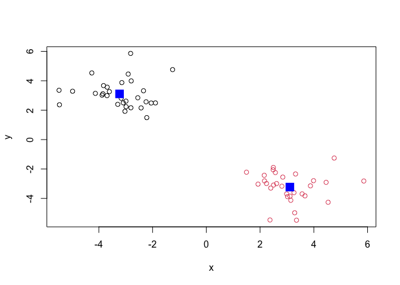
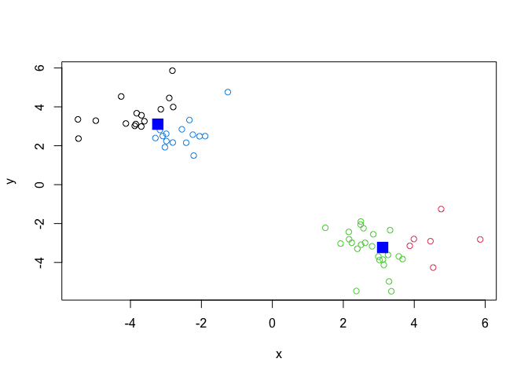
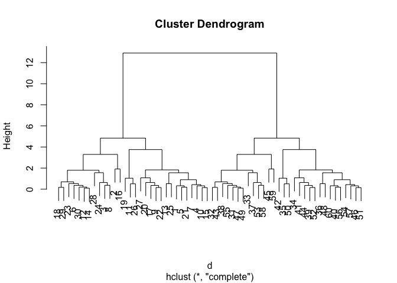
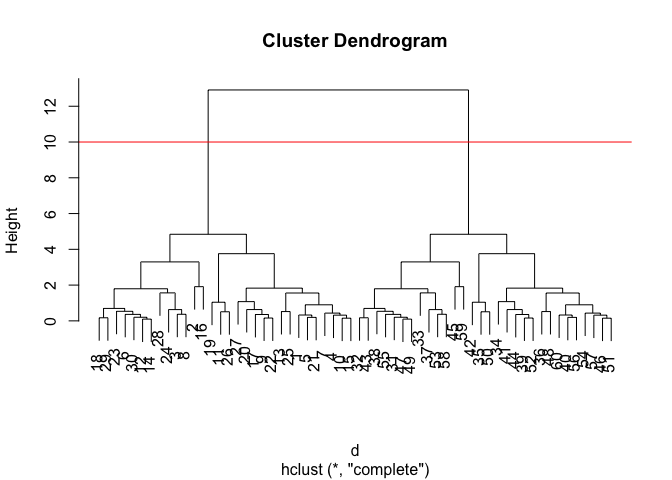
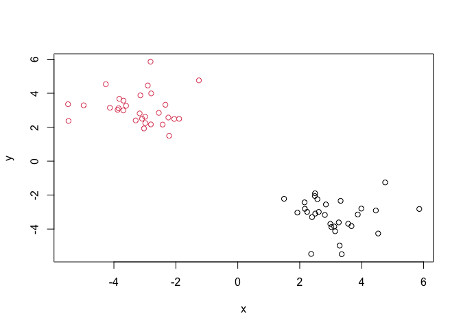
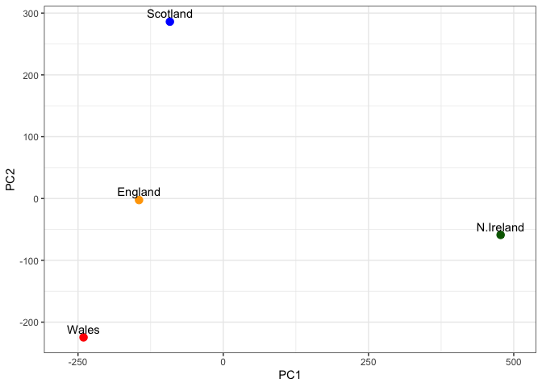
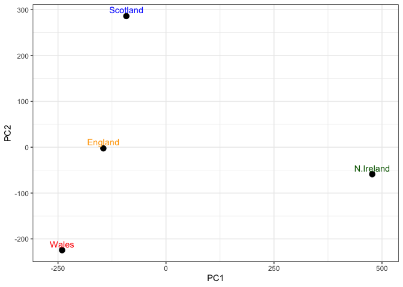
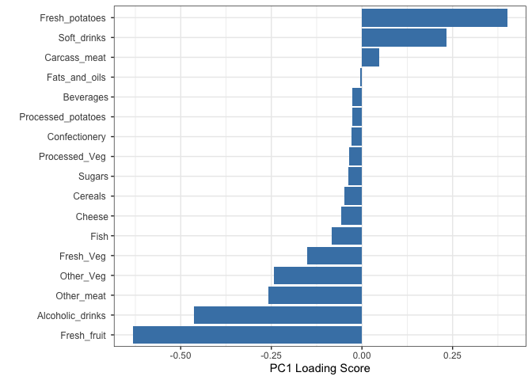

# Class 7: Machine Learning 1
Harshita Jha (PID: A17350910)

- [Background](#background)
- [K-means clustering](#k-means-clustering)
- [Hierarchical clustering](#hierarchical-clustering)
- [Principal Component Analysis
  (PCA)](#principal-component-analysis-pca)
  - [PCA of UK food data](#pca-of-uk-food-data)
  - [Pair plots and heatmaps](#pair-plots-and-heatmaps)
  - [Heatmap](#heatmap)
- [PCA to the rescue](#pca-to-the-rescue)
- [Digging deeper (variable
  loadings)](#digging-deeper-variable-loadings)

## Background

Today we will begin our exploration of important machine learning
methods with a focus on **clustering** and **dimensionality reduction**.

To start testing these methods, let’s make some sample data to cluster
where we know what the answer should be.

``` r
hist(rnorm(3000, mean=10))
```



> Q. Can you generate 30 numbers centered at +3 and 30 numbers at -3
> taken at random from a normal distribution?

``` r
tmp <- c(rnorm(30,3), 
rnorm(30,-3))

x <- cbind(x=tmp, y=rev(tmp))

plot(x)
```



## K-means clustering

The main function in “base R” for k-means clustering is called
`kmeans()`, let’s try it out:

``` r
k<- kmeans(x, centers=2)
k
```

    K-means clustering with 2 clusters of sizes 30, 30

    Cluster means:
              x         y
    1 -3.228961  3.108567
    2  3.108567 -3.228961

    Clustering vector:
     [1] 2 2 2 2 2 2 2 2 2 2 2 2 2 2 2 2 2 2 2 2 2 2 2 2 2 2 2 2 2 2 1 1 1 1 1 1 1 1
    [39] 1 1 1 1 1 1 1 1 1 1 1 1 1 1 1 1 1 1 1 1 1 1

    Within cluster sum of squares by cluster:
    [1] 54.18187 54.18187
     (between_SS / total_SS =  91.7 %)

    Available components:

    [1] "cluster"      "centers"      "totss"        "withinss"     "tot.withinss"
    [6] "betweenss"    "size"         "iter"         "ifault"      

> Q. What component of your kmeans result object has the cluster
> centers?

``` r
k$centers
```

              x         y
    1 -3.228961  3.108567
    2  3.108567 -3.228961

> Q. What component of your kmeans result has the cluster size (i.e how
> many points are in each cluster) ?

``` r
k$size
```

    [1] 30 30

> Q. What component of your kmeans result has the cluster membership
> vector (i.e the main clustering result: which points are in the which
> cluster) ?

``` r
k$cluster
```

     [1] 2 2 2 2 2 2 2 2 2 2 2 2 2 2 2 2 2 2 2 2 2 2 2 2 2 2 2 2 2 2 1 1 1 1 1 1 1 1
    [39] 1 1 1 1 1 1 1 1 1 1 1 1 1 1 1 1 1 1 1 1 1 1

> Q. Plot thr results of clustering (i.e our data colored by the
> clustering results) along with the cluster centers.

``` r
plot(x, col=k$cluster)
points(k$centers, col="blue", pch=15, cex=2)
```



> Q. Can you run `kmeans()` again and cluster into 4 clusters and plot
> the results just like we did above with coloring by cluster and the
> cluster centers shown in blue?

``` r
k4 <- kmeans(x, 4)
plot(x, col=k4$cluster)
points(k$centers, col="blue", pch=15, cex=2)
```



> **Key-point:** Kmeans will always return the clustering that we ask
> for (this is the “K” or “centers” in K-means)!

``` r
k4$tot.withinss
```

    [1] 69.35657

## Hierarchical clustering

The main function for hierarchical clustering in base R is called
`hclust()`. One of the main differences with respect to the K-means
function is that you can not just pass your input data directly to
`hclust()`- it needs a “distance matrix” as input. We can get this from
lot’s of places including the `dist()` function.

``` r
d<- dist(x)
hc <- hclust(d)
plot(hc)
```



We can “cut” the dendrogram or tree at a given height to yield our
“clusters”. For this we use the function `cutree()`.

``` r
plot(hc)
abline(h=10, col="red")
```



``` r
grps <- cutree(hc, h=10)
```

``` r
grps
```

     [1] 1 1 1 1 1 1 1 1 1 1 1 1 1 1 1 1 1 1 1 1 1 1 1 1 1 1 1 1 1 1 2 2 2 2 2 2 2 2
    [39] 2 2 2 2 2 2 2 2 2 2 2 2 2 2 2 2 2 2 2 2 2 2

> Q. Plot our data `x` colored by the clustering result from `hclust()`
> and `cutree`.

``` r
plot(x, col=grps)
```



## Principal Component Analysis (PCA)

PCA is a popular dimensionality reduction technique that is widely used
in bioinformatics.

### PCA of UK food data

Read data on food consumption in the UK

``` r
url <- "https://tinyurl.com/UK-foods"
x <- read.csv(url)
x
```

                         X England Wales Scotland N.Ireland
    1               Cheese     105   103      103        66
    2        Carcass_meat      245   227      242       267
    3          Other_meat      685   803      750       586
    4                 Fish     147   160      122        93
    5       Fats_and_oils      193   235      184       209
    6               Sugars     156   175      147       139
    7      Fresh_potatoes      720   874      566      1033
    8           Fresh_Veg      253   265      171       143
    9           Other_Veg      488   570      418       355
    10 Processed_potatoes      198   203      220       187
    11      Processed_Veg      360   365      337       334
    12        Fresh_fruit     1102  1137      957       674
    13            Cereals     1472  1582     1462      1494
    14           Beverages      57    73       53        47
    15        Soft_drinks     1374  1256     1572      1506
    16   Alcoholic_drinks      375   475      458       135
    17      Confectionery       54    64       62        41

It looks like teh row names are not set properly. We can fix this

``` r
rownames(x) <- x[,1]
x <- x[,-1]
```

A better way to do this is fix the rownames assignment at import time:

``` r
x<- read.csv(url, row.names = 1)
```

> Q1. Complete the following code to find out how many rows and columns
> are in x? \_\_\_(x)

``` r
dim(x)
```

    [1] 17  4

> Q2. Which approach to solving the ‘row-names problem’ mentioned above
> do you prefer and why? Is one approach more robust than another under
> certain circumstances?

Approach 2 is better because it fixes the row names problem when reading
the data, making it easier and more consistent to work with eventually.
The first approach can lead to data deletion if we run more than once so
it is dangerous and less recommended.

``` r
barplot(as.matrix(x), beside=T, col=rainbow(nrow(x)))
```


> Q3: Changing what optional argument in the above barplot() function
> results in the following plot?

Changing the `beside` optional argument in the above `barplot()` from T
to F results in the change of plot from the one above to the following
one.

``` r
barplot(as.matrix(x), beside=F, col=rainbow(nrow(x)))
```


- Tidying up the data

``` r
# install.packages("tidyr")
library(tidyr)
x_long <- x |> 
          tibble::rownames_to_column("Food") |> 
          pivot_longer(cols = -Food, 
                       names_to = "Country", 
                       values_to = "Consumption")

dim(x_long)
```

    [1] 68  3

> Q4: Changing what optional argument in the above ggplot() code results
> in a stacked barplot figure?

Skipping Q4 as instructed by Prof. Grant

### Pair plots and heatmaps

> Q5: We can use the pairs() function to generate all pairwise plots for
> our countries. Can you make sense of the following code and resulting
> figure? What does it mean if a given point lies on the diagonal for a
> given plot?

``` r
pairs(x, col=rainbow(nrow(x)), pch=16)
```


17 different points give the 17 different food categories being studied.
If the countries had similar values of the food categories, the points
would lie on the diagonal. If the two countries being compared have
different value for a particular food category, then the point will not
be on the diagonal.

### Heatmap

We can install the **pheatmap** package with the `install.packages()`
command used previously. Remember that we always run this in the console
and not in the code chunk.

``` r
library(pheatmap)
pheatmap( as.matrix(x) )
```


Of all these plot really the `pairs()` plot was useful. This however
took a bit of work to interpret and will it scale when I am looking at
much bigger data sets.

> Q6. Based on the pairs and heatmap figures, which countries cluster
> together and what does this suggest about their food consumption
> patterns? Can you easily tell what the main differences between N.
> Ireland and the other countries of the UK in terms of this data-set?

Based on the pairs and heatmap figures, England and Wales seem to
cluster closer together with Scotland clustering nearby while Northern
Ireland seems more distant from the other countries. However, it quite
difficult to analyze even this small data set from these graphs and
therefore, not easy to tell what the main differences between N. Ireland
and the other countries of the UK in terms of this data-set.Therefore,
we use PCA as a better analytical method.

## PCA to the rescue

The main function in “base R” for PCA is called `prcomp()`.

``` r
pca <- prcomp(t(x))
summary(pca)
```

    Importance of components:
                                PC1      PC2      PC3     PC4
    Standard deviation     324.1502 212.7478 73.87622 2.7e-14
    Proportion of Variance   0.6744   0.2905  0.03503 0.0e+00
    Cumulative Proportion    0.6744   0.9650  1.00000 1.0e+00

> Q. How much variance is captired in the first PC?

From the table, we see for that variance captured for PC1 is 67.4%

> Q. How many PCs do I need to capture atleast 90% of the total variance

From the table, we see that two PCs capture 96.5% of the total variance.

> Q. Plot our main PCA result. Folks can call this different things
> depending on their field of study e.g. “PC plot”, “ordienation plot”,
> “score plot” etc.

``` r
attributes(pca)
```

    $names
    [1] "sdev"     "rotation" "center"   "scale"    "x"       

    $class
    [1] "prcomp"

To generate our PCA score plot we want the `pca$x` component of the
result object.

``` r
pca$x
```

                     PC1         PC2        PC3           PC4
    England   -144.99315   -2.532999 105.768945  1.612425e-14
    Wales     -240.52915 -224.646925 -56.475555  4.751043e-13
    Scotland   -91.86934  286.081786 -44.415495 -6.044349e-13
    N.Ireland  477.39164  -58.901862  -4.877895  1.145386e-13

``` r
my_cols <- c("orange","red","blue","darkgreen")
plot(pca$x[,1],pca$x[,2], col=my_cols, pch=16)
```


> Q7. Complete the code below to generate a plot of PC1 vs PC2. The
> second line adds text labels over the data points.

``` r
library(ggplot2)
```

- Plot PC1 vs PC2 with ggplot

``` r
ggplot(pca$x) +
  aes(x = PC1, y = PC2, label = rownames(pca$x)) +
  geom_point(size = 3,col=my_cols ) +
  geom_text(vjust = -0.5) +
  xlim(-270, 500) +
  xlab("PC1") +
  ylab("PC2") +
  theme_bw()
```



> Q8. Customize your plot so that the colors of the country names match
> the colors in our UK and Ireland map and table at start of this
> document.

``` r
ggplot(pca$x) +
  aes(x = PC1, y = PC2, label = rownames(pca$x)) +
  geom_point(size = 3 ) +
  geom_text(vjust = -0.5, col= my_cols) +
  xlim(-270, 500) +
  xlab("PC1") +
  ylab("PC2") +
  theme_bw()
```



## Digging deeper (variable loadings)

How do the original variables (i.e. the 17 different foods) contribute
to our new PCs.

``` r
library(ggplot2)
ggplot(pca$rotation) +
  aes(x = PC1, 
      y = reorder(rownames(pca$rotation), PC1)) +
  geom_col(fill = "steelblue") +
  xlab("PC1 Loading Score") +
  ylab("") +
  theme_bw() +
  theme(axis.text.y = element_text(size = 9))
```



> Q9: Generate a similar ‘loadings plot’ for PC2. What two food groups
> feature prominantely and what does PC2 maninly tell us about?

``` r
ggplot(pca$rotation) +
  aes(x = PC2, 
      y = reorder(rownames(pca$rotation), PC2)) +
  geom_col(fill = "steelblue") +
  xlab("PC2 Loading Score") +
  ylab("") +
  theme_bw() +
  theme(axis.text.y = element_text(size = 9))
```


Two groups that feature prominently are “Fresh_potatoes” and
“Soft_drinks” on the plot. The observations (foods) with the largest
positive loading scores that “push” Scotland upwards positive side of
the plot include “Soft_drinks” and “Alcoholic_drinks”.
Observations/foods with high negative scores that push the other
countries downward on the plot include “Fresh_potatoes” and “Other_veg”.
So, PC2 loading plot helps us to analyze which food categories determine
the difference between countries with high PC2 scores from countries
with low PC2 scores.
