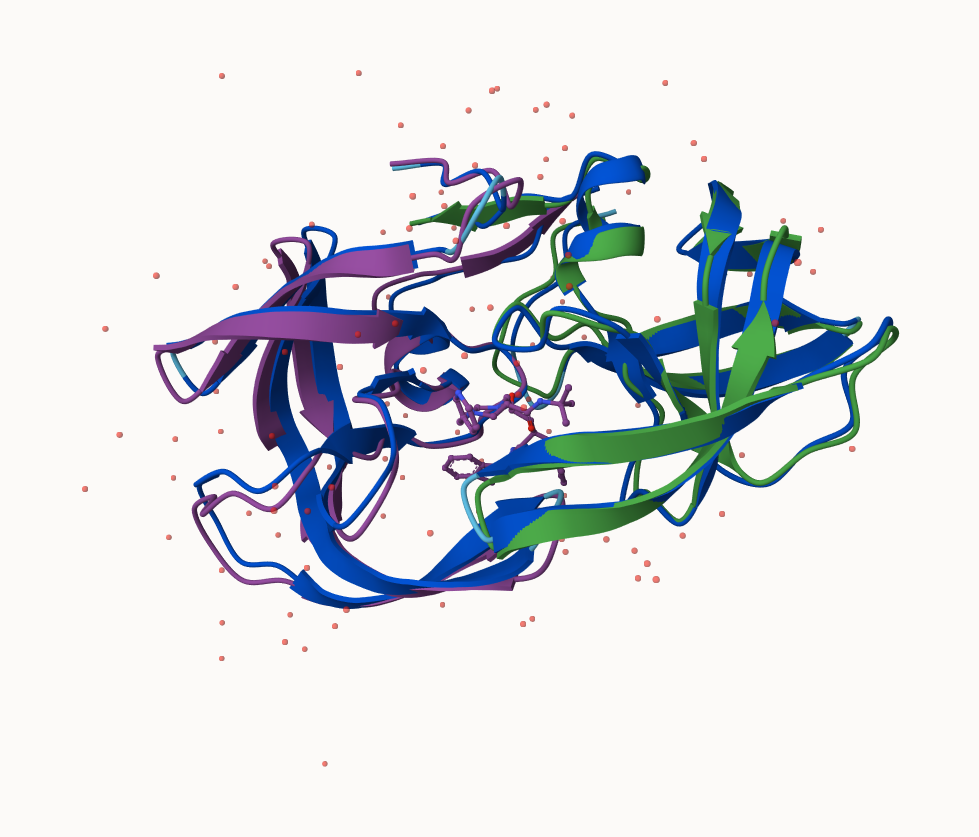
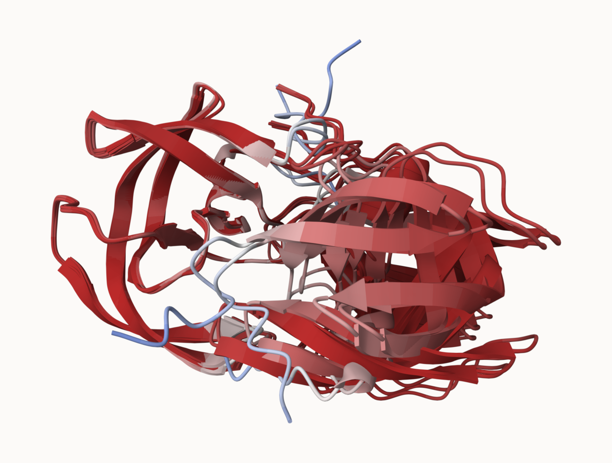
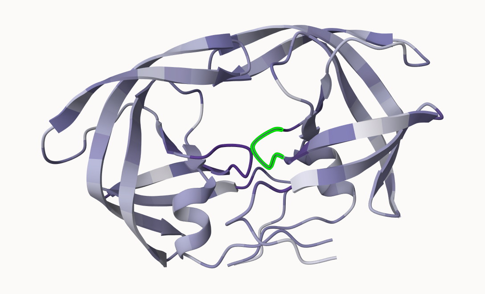

## Background

We saw last day that the main repository for biomolecular structure (the PDB databse) only has ~250,000 entries. 

UniProtKB (the main protein seq database) has over 200 million entries!

## AlphaFold

In this hands-on session we will utilize AlphaFold to predict protein structure from sequence (Jumper et al. 2021).

Without the aid of such approaches, it can take years of expensive laboratory work to determine the structure of just one protein. With AlphaFold we can now accurately compute a typical protein structure in as little as ten minutes.

## The EBI AlphaFold database

The EBI alphafold database contains lots of computer structure models. It is increasingly likely that the structure that you are interested in is already in the databse at <https://alphafold.ebi.ac.uk/>

There are 3 major outputs from alphafold

1. A model of structure in **PDB** format.
2. A **pLDDT score** that tells us how confident the model is for a given residue in your protein (High score above 70 are good).
3. A **PAE score** that tells us about protein packing quality.

If you cannot find a matching entry for the sequence you are interested in AFDB you can run AlphaFold yourself...


## Running AlphaFold

We will use `ColabFold` to run AlphaFold. 

## Figure from AlphaFold



## Interpreting results

Custom analysis of resulting models

```{r}
results_dir <- "hivpr_23119/"
```


```{r}
library(bio3d)
pdb_files <- list.files("hivpr_23119/", patter= ".pdb", full.names = TRUE)

## Print our PDB file names
basename(pdb_files)
```

```{r}
library(bio3d)

# Read all data from Models 
#  and superpose/fit coords
pdbs <- pdbaln(pdb_files, fit=TRUE, exefile="msa")
```

```{r}
pdbs
```

```{r}
rd <- rmsd(pdbs, fit=T)
```

```{r}
range(rd)
```

Now, we can draw a heatmap of these RMSD matrix values

```{r}
library(pheatmap)

colnames(rd) <- paste0("m",1:5)
rownames(rd) <- paste0("m",1:5)
pheatmap(rd)
```
```{r}
# Reading a reference PDB structure
pdb <- read.pdb("1hsg")
```


```{r}
plotb3(pdbs$b[1,], typ="l", lwd=2, sse=pdb)
points(pdbs$b[2,], typ="l", col="red")
points(pdbs$b[3,], typ="l", col="blue")
points(pdbs$b[4,], typ="l", col="darkgreen")
points(pdbs$b[5,], typ="l", col="orange")
abline(v=100, col="gray")

```

To improve the fitting of our models by finding the most "rigid core" common across all the models, we use `core.find()`.

```{r}
core <- core.find(pdbs)
```

Now, the identified core atom positions can be used to as a basis for a more suitable superposition and write out the fitted structures to a directory called `corefit_structures`:

```{r}
core.inds <- print(core, vol=0.5)
```
```{r}
xyz <- pdbfit(pdbs, core.inds, outpath="corefit_structures")
```

Open the `corefit_structures/` in Molstar and clor by **Atom Property** of **Uncertainty/Disorder**: 



Now, we examine the RMSF (used measure of conformational variance along the structure) between positions of the structure: 

```{r}
rf <- rmsf(xyz)

plotb3(rf, sse=pdb)
abline(v=100, col="gray", ylab="RMSF")
```

- From this we observe the high variability in the second chain while the first chain remains quite similar across the different models.


## Predicted Alignment Error for domains (PAE)

PAE us a metric provided by AlphaFold, reported in the JSON output filed (one per predicted model). 

Below, we can load these files and observe that AlphaFold gives a seful inter-domain prediction for model 1 and 2 but not for 3,4 and 5.

```{r}
library(jsonlite)

# Listing of all PAE JSON files
pae_files <-list.files(path=results_dir,
                        pattern=".*model.*\\.json",
                        full.names = TRUE)
```

Reading file 1 and 5:

```{r}
pae1 <- read_json(pae_files[1],simplifyVector = TRUE)
pae5 <- read_json(pae_files[5],simplifyVector = TRUE)

attributes(pae1)
```
```{r}
# Per-residue pLDDT scores 
#  same as B-factor of PDB..
head(pae1$plddt) 
```

```{r}
pae1$max_pae
```

```{r}
pae5$max_pae
```

- Maximum PAE scores are useful for ranking models. *Lower score is better*. So from the results above, we can see that model 5 with much higher maximum PAE score is much worse than model 1.

Now, plotting the PAE scores with ggplot or Bio3D package functions: 

```{r}
plot.dmat(pae1$pae, 
          xlab="Residue Position (i)",
          ylab="Residue Position (j)")
```

```{r}
plot.dmat(pae5$pae, 
          xlab="Residue Position (i)",
          ylab="Residue Position (j)",
          grid.col = "black",
          zlim=c(0,30))
```

- Plotting model 1 using the **same data range** as plot for model 5: 

```{r}
plot.dmat(pae1$pae, 
          xlab="Residue Position (i)",
          ylab="Residue Position (j)",
          grid.col = "black",
          zlim=c(0,30))
```


## Residue conservation from alignment file 

```{r}
aln_file <- list.files(path=results_dir,
                       pattern=".a3m$",
                        full.names = TRUE)
aln_file


```

```{r}
aln <- read.fasta(aln_file[1], to.upper = TRUE)
```

> Q. How many sequences are in this alignment?

```{r}
dim(aln$ali)
```

Now, score the residue conservation in the alignment with the `conserv()` function: 

```{r}
sim <- conserv(aln)
```

```{r}
plotb3(sim[1:99], sse=trim.pdb(pdb, chain="A"),
       ylab="Conservation Score")
```

```{r}
con <- consensus(aln, cutoff = 0.9)
con$seq
```

Now, we can map this conservation score to the Occupancy column of a PDB file for viewing in molecular viewer programs such as Molstar.

```{r}
m1.pdb <- read.pdb(pdb_files[1])
occ <- vec2resno(c(sim[1:99], sim[1:99]), m1.pdb$atom$resno)
write.pdb(m1.pdb, o=occ, file="m1_conserv.pdb")
```

Below is an image from Molstar using color by Occupancy. The DTGA motif of one chain is highlighted:



- Through this we can see the central conserved active site where the natural peptide substrate and small molecule inhibitors would bind between domains.