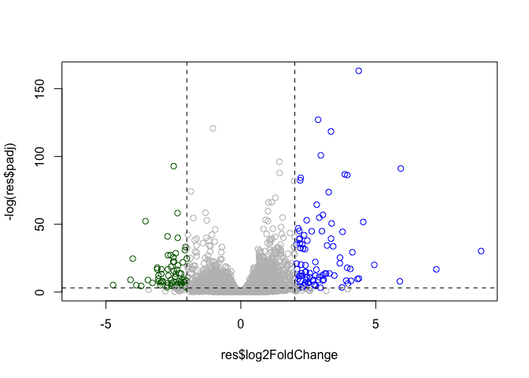
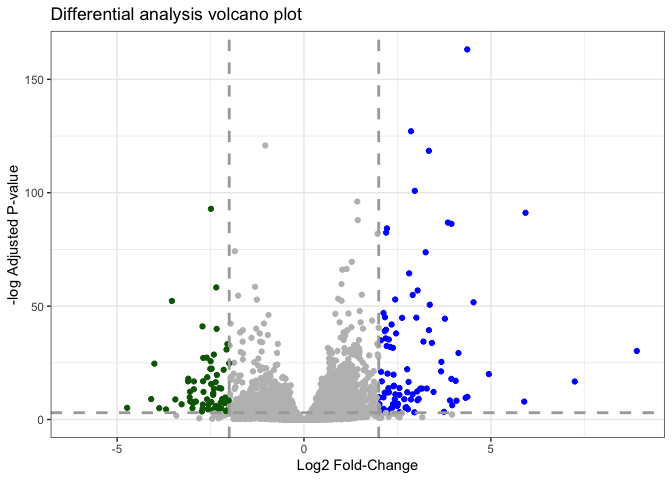

# Class 13 Transcriptomics and Analysis of RNA Seq data
Harshita Jha (PID: A17350910)

- [Background](#background)
- [Bioconductor Setup](#bioconductor-setup)
- [Data Import](#data-import)
- [Differential gene expression](#differential-gene-expression)
- [DESeq analysis](#deseq-analysis)
  - [Run the DESeq analysis pipeline](#run-the-deseq-analysis-pipeline)
- [Volcano Plot](#volcano-plot)
  - [Adding some color annotation](#adding-some-color-annotation)
- [Save our results](#save-our-results)
- [Adding annotation data](#adding-annotation-data)
- [Save annotated results to a CSV
  file](#save-annotated-results-to-a-csv-file)
- [Pathway Analysis](#pathway-analysis)

## Background

Today we will perform an RNASeq analysis of the effects of a common
steroid on airway cells.

In particular, dexamethasone (hereafter just called “dex”) on different
airway smooth muscle cell lines (ASM cells).

## Bioconductor Setup

``` r
# BiocManager::install("DESeq2")
library(DESeq2)
library(BiocManager)
```

## Data Import

We need two different inputs:

- **countData**:with genes in rows and experiments in the columns
- **colData**: Meta data that describes the columns in the countData

``` r
counts <- read.csv("airway_scaledcounts.csv", row.names=1)
metadata <-  read.csv("airway_metadata.csv")
```

Wee peak at the counts and metadata

``` r
head(counts)
```

                    SRR1039508 SRR1039509 SRR1039512 SRR1039513 SRR1039516
    ENSG00000000003        723        486        904        445       1170
    ENSG00000000005          0          0          0          0          0
    ENSG00000000419        467        523        616        371        582
    ENSG00000000457        347        258        364        237        318
    ENSG00000000460         96         81         73         66        118
    ENSG00000000938          0          0          1          0          2
                    SRR1039517 SRR1039520 SRR1039521
    ENSG00000000003       1097        806        604
    ENSG00000000005          0          0          0
    ENSG00000000419        781        417        509
    ENSG00000000457        447        330        324
    ENSG00000000460         94        102         74
    ENSG00000000938          0          0          0

> Q1. How many genes are in this dataset?

``` r
nrow(counts)
```

    [1] 38694

- There are 38694 genes in this dataset.

> Q2. How many ‘control’ cell lines do we have?

``` r
table(metadata$dex)
```


    control treated 
          4       4 

- We have 4 ‘control’ cell lines.

## Differential gene expression

We have 4 replicate drug treated and control (no drug)
columns/experiments in our `counts` object.

We want one “mean” value for each gene (rows) in “treated” and one mean
value for each gene in “control” columns.

Step 1. Find all “control” columns

``` r
control.inds <- metadata$dex == "control"
```

Step 2. Extract these columns to a new object called `control.counts`

``` r
control.counts <- counts[,control.inds]
```

Step 3. Calculate row-wise mean of the new object

``` r
control.mean <- rowMeans(control.counts)
```

> Q3. How would you make the above code in either approach more robust?
> Is there a function that could help here?

- As seen above in our code, using `rowMeans` function is a useful way
  to make this kind of analysis more robust because if we use this
  function, we are computing the mean of the rows directly without
  mentioning a set number of samples because if we set the number of
  samples in our code, it will not calculate correct answers if the data
  set changes (samples added/removed).

> Q4.Follow the same procedure for the treated samples (i.e. calculate
> the mean per gene across drug treated samples and assign to a labeled
> vector called `treated.mean`.

``` r
treated.inds <- metadata$dex == "treated"
treated.counts <- counts[,treated.inds]
treated.mean <- rowMeans(treated.counts)
```

> Q5a.Create a scatter plot showing the mean of the treated samples
> against the mean of the control samples.

- Now plotting these means against each other:

``` r
meancounts <- data.frame(control.mean, treated.mean)
plot(meancounts)
```


> Q5 (b).You could also use the ggplot2 package to make this figure
> producing the plot below. What geom\_?() function would you use for
> this plot?

``` r
library(ggplot2)
ggplot(meancounts) + 
  aes(x=control.mean, y=treated.mean)+
  geom_point()
```


- We can use the geom_point function for this plot.

> Q6. Try plotting both axes on a log scale. What is the argument to
> plot() that allows you to do this?

Let’s log transform this count data:

``` r
plot(meancounts, log="xy")
```

    Warning in xy.coords(x, y, xlabel, ylabel, log): 15032 x values <= 0 omitted
    from logarithmic plot

    Warning in xy.coords(x, y, xlabel, ylabel, log): 15281 y values <= 0 omitted
    from logarithmic plot


**N.B** We most often use log2 for this type of data as it makes the
interpretation much more straightforward.

Treated/control is often called “fold-change”

If we have the same amount of transcript around

``` r
log2(10/10)
```

    [1] 0

- The log2 fold change would be 0.

If we had double the amount of transcript around

``` r
log2(20/10)
```

    [1] 1

- This has a log2 fold-change of 1.

If we had half as much transcript around

``` r
log2(5/10)
```

    [1] -1

- This has a log2 fold change of -1 (when we are halving).

> Q. Calculate the log2 fold change value fir all our genes and add it
> as a new column to our `meancounts` object.

``` r
meancounts$log2fc <- log2(meancounts$treated.mean/meancounts$control.mean)

head(meancounts)
```

                    control.mean treated.mean      log2fc
    ENSG00000000003       900.75       658.00 -0.45303916
    ENSG00000000005         0.00         0.00         NaN
    ENSG00000000419       520.50       546.00  0.06900279
    ENSG00000000457       339.75       316.50 -0.10226805
    ENSG00000000460        97.25        78.75 -0.30441833
    ENSG00000000938         0.75         0.00        -Inf

There are some “funky” log2fc values (NaN and -Inf) here that come about
whenever we have 0 mean count values. Typically we would remove these
genes from any further analysis- as we can’t say anything about them if
we ahve no data for them.

``` r
zero.vals <- which(meancounts[,1:2]==0, arr.ind=TRUE)

to.rm <- unique(zero.vals[,1])
mycounts <- meancounts[-to.rm,]
head(mycounts)
```

                    control.mean treated.mean      log2fc
    ENSG00000000003       900.75       658.00 -0.45303916
    ENSG00000000419       520.50       546.00  0.06900279
    ENSG00000000457       339.75       316.50 -0.10226805
    ENSG00000000460        97.25        78.75 -0.30441833
    ENSG00000000971      5219.00      6687.50  0.35769358
    ENSG00000001036      2327.00      1785.75 -0.38194109

> Q7. What is the purpose of the arr.ind argument in the which()
> function call above? Why would we then take the first column of the
> output and need to call the unique() function?

- When the arr.ind argument is set to TRUE the which() function returns
  the position of row and coloums where the condition is true. In this
  case this will tell us which genes (rows) and sample (columns) have
  zero counts. The first column contains the row numbers/genes that have
  zero counts in any sample so we just focus on the first column.
  Calling the unique() function ensures that we don’t count any row
  twice if it has zero entries in both samples.

Now, finding out which genes are up or down-regulated:

``` r
up.ind <- mycounts$log2fc > 2
down.ind <- mycounts$log2fc < (-2)
```

> Q8.Using the up.ind vector above can you determine how many up
> regulated genes we have at the greater than 2 fc level?

``` r
sum(up.ind)
```

    [1] 250

- There are 250 up regulated genes at the greater than 2 fc level.

> Q9. Using the down.ind vector above can you determine how many down
> regulated genes we have at the greater than 2 fc level?

``` r
sum(down.ind)
```

    [1] 367

- there are 367 down regulated genes at the greater than 2 fc level.

> Q10.Do you trust these results? Why or why not?

- No, these results cannot be trusted yet since we are yet to determine
  the statistical significance of the differences that are being
  observed. Analysis should be done using the DESeq2 package further to
  generate more reliable results.

## DESeq analysis

Let’s do this analysis with an estimate od statistical significance
using the **DESeq2** package

``` r
library(DESeq2)
```

DESeq (like many bioconductor packages) wants its data input in a very
specific way.

``` r
dds <- DESeqDataSetFromMatrix(countData = counts,
                       colData= metadata, 
                       design= ~dex)
```

    converting counts to integer mode

    Warning in DESeqDataSet(se, design = design, ignoreRank): some variables in
    design formula are characters, converting to factors

### Run the DESeq analysis pipeline

The main function in this package is called `DESeq()`

``` r
dds <- DESeq(dds)
```

    estimating size factors

    estimating dispersions

    gene-wise dispersion estimates

    mean-dispersion relationship

    final dispersion estimates

    fitting model and testing

``` r
res<- results(dds)
head(res)
```

    log2 fold change (MLE): dex treated vs control 
    Wald test p-value: dex treated vs control 
    DataFrame with 6 rows and 6 columns
                      baseMean log2FoldChange     lfcSE      stat    pvalue
                     <numeric>      <numeric> <numeric> <numeric> <numeric>
    ENSG00000000003 747.194195      -0.350703  0.168242 -2.084514 0.0371134
    ENSG00000000005   0.000000             NA        NA        NA        NA
    ENSG00000000419 520.134160       0.206107  0.101042  2.039828 0.0413675
    ENSG00000000457 322.664844       0.024527  0.145134  0.168996 0.8658000
    ENSG00000000460  87.682625      -0.147143  0.256995 -0.572550 0.5669497
    ENSG00000000938   0.319167      -1.732289  3.493601 -0.495846 0.6200029
                         padj
                    <numeric>
    ENSG00000000003  0.163017
    ENSG00000000005        NA
    ENSG00000000419  0.175937
    ENSG00000000457  0.961682
    ENSG00000000460  0.815805
    ENSG00000000938        NA

## Volcano Plot

This is a main summary results figure from these kinds of studies. It is
a plot of log2 fold change vs (Adjusted) p-value.

``` r
plot(res$log2FoldChange,
     res$padj)
```


Again this y-axis is highly skewed and needs log transforming and we can
flip the y-axis with a minus sign so it look luke every other volcano
plot.

``` r
plot(res$log2FoldChange,
     -log(res$padj))
abline(v=-2, col="red")
abline(v=2, col="red")
abline(h=-log(0.05), col="red")
```


### Adding some color annotation

Start with default base color “gray”

``` r
mycols <- rep("gray", nrow(res))
mycols[res$log2FoldChange > 2] <- "blue"
mycols[res$log2FoldChange < -2] <- "darkgreen"
mycols[res$padj >= 0.05] <- "gray"

plot(res$log2FoldChange,
     -log(res$padj),
     col=mycols)

abline(v=c(-2,2),lty=2)
abline(h=-log(0.05),lty=2)
```



> Q. Make a ggplot version of this plot (presentation quality). Include
> clear axis labels, a clean theme, your custom colors, cut-off lines
> and a plot title.

``` r
library(ggplot2)

ggplot(res) + aes(log2FoldChange, -log(padj)) + geom_point(colour= mycols) +
labs(title= "Differential analysis volcano plot", x="Log2 Fold-Change", 
     y= "-log Adjusted P-value") + 
  geom_hline(yintercept = -log(0.05), color= "darkgray", linetype= "dashed", size=1) + 
  geom_vline(xintercept= c(-2,2), color= "darkgray", linetype= "dashed", size=1) +
theme_bw()
```

    Warning: Using `size` aesthetic for lines was deprecated in ggplot2 3.4.0.
    ℹ Please use `linewidth` instead.

    Warning: Removed 23549 rows containing missing values or values outside the scale range
    (`geom_point()`).



## Save our results

Write a CSV file

``` r
write.csv(res, file="results.csv")
```

## Adding annotation data

We need to add missing annotation data to our main `res` results
objects. This includes the common gene “symbol” useful for other people
to easily read the data.

``` r
head(res)
```

    log2 fold change (MLE): dex treated vs control 
    Wald test p-value: dex treated vs control 
    DataFrame with 6 rows and 6 columns
                      baseMean log2FoldChange     lfcSE      stat    pvalue
                     <numeric>      <numeric> <numeric> <numeric> <numeric>
    ENSG00000000003 747.194195      -0.350703  0.168242 -2.084514 0.0371134
    ENSG00000000005   0.000000             NA        NA        NA        NA
    ENSG00000000419 520.134160       0.206107  0.101042  2.039828 0.0413675
    ENSG00000000457 322.664844       0.024527  0.145134  0.168996 0.8658000
    ENSG00000000460  87.682625      -0.147143  0.256995 -0.572550 0.5669497
    ENSG00000000938   0.319167      -1.732289  3.493601 -0.495846 0.6200029
                         padj
                    <numeric>
    ENSG00000000003  0.163017
    ENSG00000000005        NA
    ENSG00000000419  0.175937
    ENSG00000000457  0.961682
    ENSG00000000460  0.815805
    ENSG00000000938        NA

We will use R and bioconductor to do this “ID Mapping”.

``` r
# BiocManager::install("AnnotationDbi")
```

``` r
# BiocManager::install("org.Hs.eg.db")
```

Let’s see what databases we can use for translation/mapping…

``` r
library("AnnotationDbi")
library("org.Hs.eg.db")
```

``` r
columns(org.Hs.eg.db)
```

     [1] "ACCNUM"       "ALIAS"        "ENSEMBL"      "ENSEMBLPROT"  "ENSEMBLTRANS"
     [6] "ENTREZID"     "ENZYME"       "EVIDENCE"     "EVIDENCEALL"  "GENENAME"    
    [11] "GENETYPE"     "GO"           "GOALL"        "IPI"          "MAP"         
    [16] "OMIM"         "ONTOLOGY"     "ONTOLOGYALL"  "PATH"         "PFAM"        
    [21] "PMID"         "PROSITE"      "REFSEQ"       "SYMBOL"       "UCSCKG"      
    [26] "UNIPROT"     

We can use the `mapIds()` function now to translate between any of these
databases.

``` r
res$symbol <- mapIds(org.Hs.eg.db,
              keys=row.names(res),  # Our genenames
              keytype="ENSEMBL",    # Their format
              column="SYMBOL" )     # The new format
```

    'select()' returned 1:many mapping between keys and columns

> Q11. Run the mapIds() function two more times to add the Entrez ID and
> GENENAME as new columns called res$entrez and res$genename.

``` r
res$entrez <- mapIds(org.Hs.eg.db,
              keys=row.names(res),  
              keytype="ENSEMBL",    
              column="ENTREZID" )
```

    'select()' returned 1:many mapping between keys and columns

``` r
res$genename <- mapIds(org.Hs.eg.db,
              keys=row.names(res),  
              keytype="ENSEMBL",    
              column="GENENAME" )
```

    'select()' returned 1:many mapping between keys and columns

``` r
head(res)
```

    log2 fold change (MLE): dex treated vs control 
    Wald test p-value: dex treated vs control 
    DataFrame with 6 rows and 9 columns
                      baseMean log2FoldChange     lfcSE      stat    pvalue
                     <numeric>      <numeric> <numeric> <numeric> <numeric>
    ENSG00000000003 747.194195      -0.350703  0.168242 -2.084514 0.0371134
    ENSG00000000005   0.000000             NA        NA        NA        NA
    ENSG00000000419 520.134160       0.206107  0.101042  2.039828 0.0413675
    ENSG00000000457 322.664844       0.024527  0.145134  0.168996 0.8658000
    ENSG00000000460  87.682625      -0.147143  0.256995 -0.572550 0.5669497
    ENSG00000000938   0.319167      -1.732289  3.493601 -0.495846 0.6200029
                         padj      symbol      entrez               genename
                    <numeric> <character> <character>            <character>
    ENSG00000000003  0.163017      TSPAN6        7105          tetraspanin 6
    ENSG00000000005        NA        TNMD       64102            tenomodulin
    ENSG00000000419  0.175937        DPM1        8813 dolichyl-phosphate m..
    ENSG00000000457  0.961682       SCYL3       57147 SCY1 like pseudokina..
    ENSG00000000460  0.815805       FIRRM       55732 FIGNL1 interacting r..
    ENSG00000000938        NA         FGR        2268 FGR proto-oncogene, ..

## Save annotated results to a CSV file

``` r
write.csv(res, file="results_annotated.csv")
```

## Pathway Analysis

The core question is **what know known biological pathways do our
differentially expressed genes overlap with (i.e play a role in)**.

There are many bioconductor packges that do this kind of analysis.

We will use one of the oldest called **gage** along with **pathview** to
render nice pics of the pathways we find.

``` r
# BiocManager::install( c("pathview", "gage", "gageData") )
```

``` r
library(pathview)
library(gage)
library(gageData)
```

Have a wee peak at what is in the `gagaData`

``` r
# Examine the first 2 pathways in this kegg set for humans
data(kegg.sets.hs)
head(kegg.sets.hs, 2)
```

    $`hsa00232 Caffeine metabolism`
    [1] "10"   "1544" "1548" "1549" "1553" "7498" "9"   

    $`hsa00983 Drug metabolism - other enzymes`
     [1] "10"     "1066"   "10720"  "10941"  "151531" "1548"   "1549"   "1551"  
     [9] "1553"   "1576"   "1577"   "1806"   "1807"   "1890"   "221223" "2990"  
    [17] "3251"   "3614"   "3615"   "3704"   "51733"  "54490"  "54575"  "54576" 
    [25] "54577"  "54578"  "54579"  "54600"  "54657"  "54658"  "54659"  "54963" 
    [33] "574537" "64816"  "7083"   "7084"   "7172"   "7363"   "7364"   "7365"  
    [41] "7366"   "7367"   "7371"   "7372"   "7378"   "7498"   "79799"  "83549" 
    [49] "8824"   "8833"   "9"      "978"   

The main `gage()` function that does the actual work wants a simple
vector as input.

The KEGG data uses ENTREZ ids so we need to provide these in our input
vector for **gage**:

``` r
foldchanges <- res$log2FoldChange
names(foldchanges) <- res$entrez
head(foldchanges)
```

           7105       64102        8813       57147       55732        2268 
    -0.35070296          NA  0.20610728  0.02452701 -0.14714263 -1.73228897 

Now we can run `gage()`:

``` r
keggres = gage(foldchanges, gsets=kegg.sets.hs)
```

What is in the output object `keggres`?

``` r
attributes(keggres)
```

    $names
    [1] "greater" "less"    "stats"  

``` r
# Look at the first three down (less) pathways
head(keggres$less, 3)
```

                                          p.geomean stat.mean        p.val
    hsa05332 Graft-versus-host disease 0.0004250607 -3.473335 0.0004250607
    hsa04940 Type I diabetes mellitus  0.0017820379 -3.002350 0.0017820379
    hsa05310 Asthma                    0.0020046180 -3.009045 0.0020046180
                                            q.val set.size         exp1
    hsa05332 Graft-versus-host disease 0.09053792       40 0.0004250607
    hsa04940 Type I diabetes mellitus  0.14232788       42 0.0017820379
    hsa05310 Asthma                    0.14232788       29 0.0020046180

We can use the **pathview** function to render a figure of any of these
pathways along with annotation for our DEGs

Let’s see the hsa05310 Asthma pathway with our DEGs colored up:

``` r
pathview(gene.data=foldchanges, pathway.id="hsa05310")
```

    'select()' returned 1:1 mapping between keys and columns

    Info: Working in directory /Users/harshitajha/Desktop/BIMM143/bimm_143git/class13

    Info: Writing image file hsa05310.pathview.png


> Q12. Can you render the same prodcedure as above to plot the pathview
> figure for the top 2 down-reguled pathways i.e “Graft-versus-host
> disease” and “Type I diabetes”?

``` r
pathview(gene.data=foldchanges, pathway.id="hsa05332")
```

    'select()' returned 1:1 mapping between keys and columns

    Info: Working in directory /Users/harshitajha/Desktop/BIMM143/bimm_143git/class13

    Info: Writing image file hsa05332.pathview.png


``` r
pathview(gene.data=foldchanges, pathway.id="hsa04940")
```

    'select()' returned 1:1 mapping between keys and columns

    Info: Working in directory /Users/harshitajha/Desktop/BIMM143/bimm_143git/class13

    Info: Writing image file hsa04940.pathview.png


