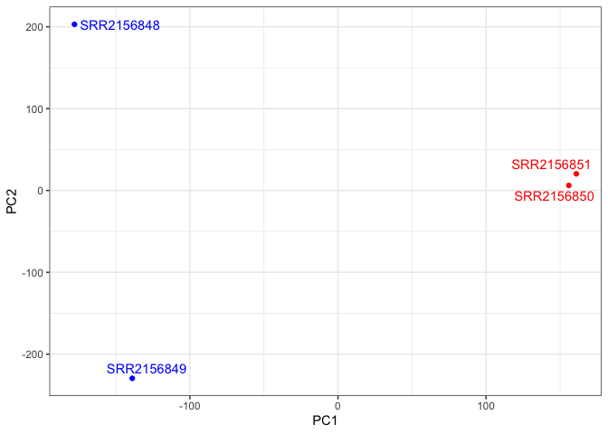
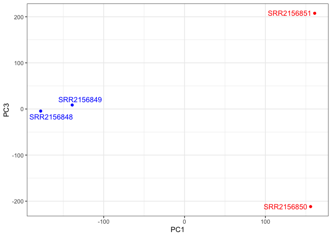
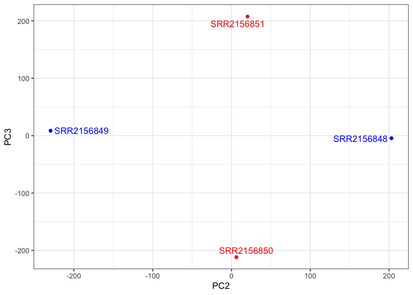

# Class 17
Harshita Jha (PID: A17350910)

## Downstream Analysis

We need to install **tximport** package for straightforward import of
Kallisto results.

- To troubleshoot import, presence of the quant folders were verified
  using the `dir()` command and the “rhdf5” bioconductor package was
  installed to read the `abundance.h5` files.

``` r
dir()
```

    [1] "SRR2156848_quant"   "SRR2156849_quant"   "SRR2156850_quant"  
    [4] "SRR2156851_quant"   "Untitled_files"     "Untitled.html"     
    [7] "Untitled.pdf"       "Untitled.qmd"       "Untitled.rmarkdown"

``` r
# BiocManager::install("tximport")
#BiocManager::install("rhdf5")
library(tximport)
library(rhdf5)

folders <- dir(pattern="SRR21568*")
samples <- sub("_quant", "", folders)
files <- file.path( folders, "abundance.h5" )
names(files) <- samples

txi.kallisto <- tximport(files, type = "kallisto", txOut = TRUE)
```

    1 2 3 4 

``` r
head(txi.kallisto$counts)
```

                    SRR2156848 SRR2156849 SRR2156850 SRR2156851
    ENST00000539570          0          0    0.00000          0
    ENST00000576455          0          0    2.62037          0
    ENST00000510508          0          0    0.00000          0
    ENST00000474471          0          1    1.00000          0
    ENST00000381700          0          0    0.00000          0
    ENST00000445946          0          0    0.00000          0

How many transcripts do we have for each sample?

``` r
colSums(txi.kallisto$counts)
```

    SRR2156848 SRR2156849 SRR2156850 SRR2156851 
       2563611    2600800    2372309    2111474 

How many transcripts are detected in at least one sample?

``` r
sum(rowSums(txi.kallisto$counts)>0)
```

    [1] 94561

We also have to filter out the annotated scripts with no reads and those
with no change over the samples:

``` r
to.keep <- rowSums(txi.kallisto$counts) > 0
kset.nonzero <- txi.kallisto$counts[to.keep,]
keep2 <- apply(kset.nonzero,1,sd)>0
x <- kset.nonzero[keep2,]
```

## Principal Component Analysis

``` r
pca <- prcomp(t(x), scale=TRUE)
summary(pca)
```

    Importance of components:
                                PC1      PC2      PC3   PC4
    Standard deviation     183.6379 177.3605 171.3020 1e+00
    Proportion of Variance   0.3568   0.3328   0.3104 1e-05
    Cumulative Proportion    0.3568   0.6895   1.0000 1e+00

### Visualizing the summarized transcriptomic profiles of each sample

``` r
plot(pca$x[,1], pca$x[,2],
     col=c("blue","blue","red","red"),
     xlab="PC1", ylab="PC2", pch=16)
```


> Q. Use ggplot to make a similar figure of PC1 vs PC2 and a separate
> figure PC1 vs PC3 and PC2 vs PC3.

- PC1 vs PC2

``` r
library(ggplot2)
library(ggrepel)

mycols <- c("blue","blue","red","red")

ggplot(pca$x) +
  aes(PC1, PC2, label=rownames(pca$x)) +
  geom_point( col=mycols ) +
  geom_text_repel( col=mycols ) +
  theme_bw()
```



-PC1 vs PC3

``` r
library(ggplot2)
library(ggrepel)

mycols <- c("blue","blue","red","red")

ggplot(pca$x) +
  aes(PC1, PC3, label=rownames(pca$x)) +
  geom_point( col=mycols ) +
  geom_text_repel( col=mycols ) +
  theme_bw()
```



- PC2 vs PC3

``` r
library(ggplot2)
library(ggrepel)

mycols <- c("blue","blue","red","red")

ggplot(pca$x) +
  aes(PC2, PC3, label=rownames(pca$x)) +
  geom_point( col=mycols ) +
  geom_text_repel( col=mycols ) +
  theme_bw()
```


