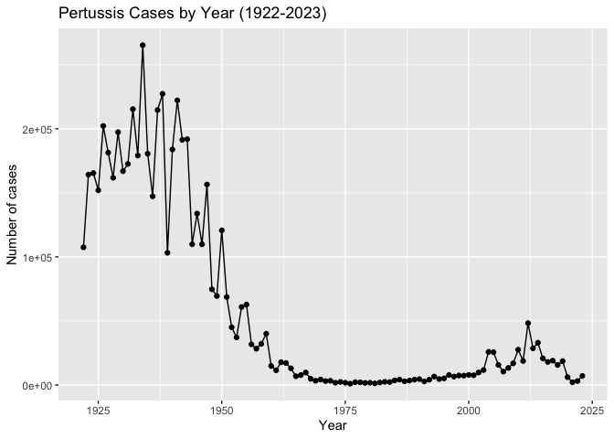
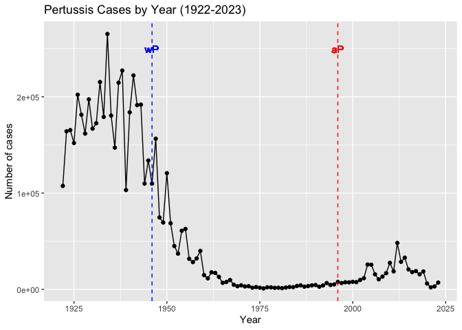
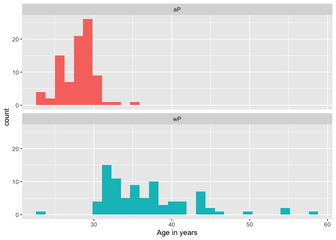
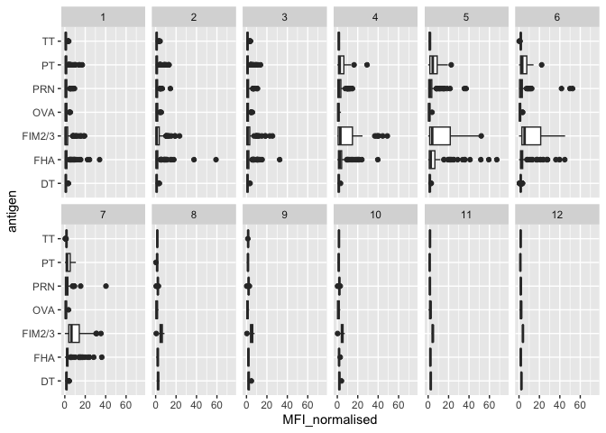
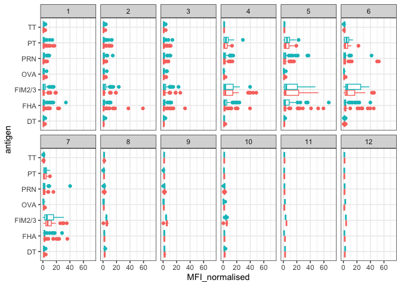
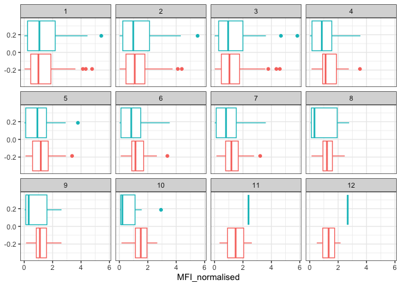
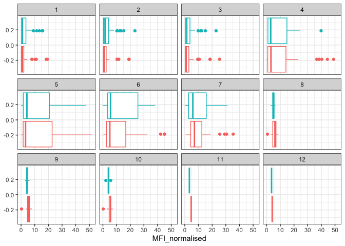
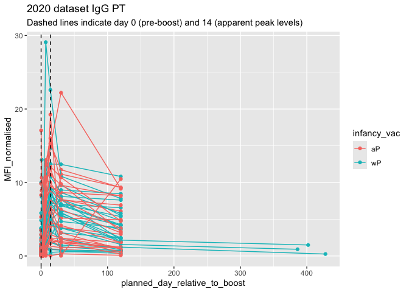

# Class 18 Mini Project
Harshita Jha (A17350910)

## Investigating pertussis cases by year

First we have to install the **datapasta** package.

> Q1. With the help of the R “addin” package datapasta assign the CDC
> pertussis case number data to a data frame called cdc and use ggplot
> to make a plot of cases numbers over time.

``` r
# install.packages("datapasta")
library (datapasta)
library(ggplot2)
cdc <- data.frame(
  year = 1922:2023,
  cases = c(
    107473, 164191, 165418, 152003, 202210, 181411, 161799, 197371,
    166914, 172559, 215343, 179135, 265269, 180518, 147237, 214652,
    227319, 103188, 183866, 222202, 191383, 191890, 109873, 133792,
    109860, 156517, 74715, 69479, 120718, 68687, 45030, 37129,
    60886, 62786, 31732, 28295, 32148, 40005, 14809, 11468,
    17749, 17135, 13005, 6799, 7717, 9718, 4810, 3285,
    4249, 3036, 3287, 1759, 2402, 1738, 1010, 2177,
    2063, 1623, 1730, 1248, 1895, 2463, 2276, 3589,
    4195, 2823, 3450, 4157, 4570, 2719, 4083, 6586,
    4617, 5137, 7796, 6564, 7405, 7298, 7867, 7580,
    9771, 11647, 25827, 25616, 15632, 10454, 13278, 16858,
    27550, 18719, 48277, 28639, 32971, 20762, 17972, 18975,
    15609, 18617, 6124, 2116, 3044, 7063
  )
)
ggplot(cdc) +
  aes(x=year, y=cases) +
  geom_point() +
  geom_line() +
  labs(x="Year", y="Number of cases", title= "Pertussis Cases by Year (1922-2023)" )
```



## A tale of two vaccines (wP & aP)

Examining the CDC data plot to see the changes that happened after the
switch to the acellular pertussis (aP) vaccination program

> Q2. Using the ggplot geom_vline() function add lines to your previous
> plot for the 1946 introduction of the wP vaccine and the 1996 switch
> to aP vaccine (see example in the hint below). What do you notice?

``` r
ggplot(cdc) +
  aes(x=year, y=cases) +
  geom_point() +
  geom_line() +
  geom_vline(xintercept = 1946, color = "blue", linetype= "dashed") + 
  geom_vline(xintercept = 1996, color = "red", linetype= "dashed") +
  geom_text(aes(x=1946, y=250000, label="wP"),color="blue") + 
  geom_text(aes(x=1996, y=250000, label="aP"), color="red") +
  labs(x="Year", y="Number of cases", title= "Pertussis Cases by Year (1922-2023)" )
```

    Warning in geom_text(aes(x = 1946, y = 250000, label = "wP"), color = "blue"): All aesthetics have length 1, but the data has 102 rows.
    ℹ Please consider using `annotate()` or provide this layer with data containing
      a single row.

    Warning in geom_text(aes(x = 1996, y = 250000, label = "aP"), color = "red"): All aesthetics have length 1, but the data has 102 rows.
    ℹ Please consider using `annotate()` or provide this layer with data containing
      a single row.



> Q3. Describe what happened after the introduction of the aP vaccine?
> Do you have a possible explanation for the observed trend?

- After the introduction of the aP vaccine, the number of Pertussis
  cases started to increase over time (as compared to the decreased/low
  cases before introduction). Even though the latter aP vaccines were
  developed to have less side effects, since they used only purified
  antigens of the bacteria instead of the broader ‘whole cell’
  inactivated bacteria, the immune response from the aP vaccine may be
  more narrow/less lasting as compared to the earlier vaccine, leading
  to an increase in the number of cases. Other hypotheses include more
  sensitive PCR-based testing, vaccination hesitancy, bacterial
  evolution (escape from vaccine immunity) and waning of the immunity in
  adolescents originally primed as infants with newe aP vaccine as
  compared to the older wP vaccine.

## Exploring CMI-PB data

### The CMI-PB API returns JSON data

For reading such files, we need to use the `read_json()` from the
**jsonlite** package.

``` r
library(jsonlite)
```

Read the main subject database table from the CMI-PB API.

``` r
subject <- read_json("https://www.cmi-pb.org/api/subject", simplifyVector = TRUE) 
```

``` r
head(subject, 3)
```

      subject_id infancy_vac biological_sex              ethnicity  race
    1          1          wP         Female Not Hispanic or Latino White
    2          2          wP         Female Not Hispanic or Latino White
    3          3          wP         Female                Unknown White
      year_of_birth date_of_boost      dataset
    1    1986-01-01    2016-09-12 2020_dataset
    2    1968-01-01    2019-01-28 2020_dataset
    3    1983-01-01    2016-10-10 2020_dataset

> Q4. How many aP and wP infancy vaccinated subjects are in the dataset?

``` r
table(subject$infancy_vac)
```


    aP wP 
    87 85 

- There are 87 aP and 85 wP infancy vaccinated subjects in the dataset.

> Q5. How many Male and Female subjects/patients are in the dataset?

``` r
table(subject$biological_sex)
```


    Female   Male 
       112     60 

- There are 112 female and 60 male subjects in the dataset.

> Q6. What is the breakdown of race and biological sex (e.g. number of
> Asian females, White males etc…)?

``` r
table(subject$biological_sex, subject$race)
```

            
             American Indian/Alaska Native Asian Black or African American
      Female                             0    32                         2
      Male                               1    12                         3
            
             More Than One Race Native Hawaiian or Other Pacific Islander
      Female                 15                                         1
      Male                    4                                         1
            
             Unknown or Not Reported White
      Female                      14    48
      Male                         7    32

### Working with dates

We use the **lubridate** package.

``` r
# install.packages("lubridate")
library(lubridate)
```


    Attaching package: 'lubridate'

    The following objects are masked from 'package:base':

        date, intersect, setdiff, union

Today’s date

``` r
today()
```

    [1] "2026-03-14"

How many days have passed since new year 2000?

``` r
today() - ymd("2000-01-01")
```

    Time difference of 9569 days

What is this in years?

``` r
time_length( today() - ymd("2000-01-01"),  "years")
```

    [1] 26.19849

> Q7. Using this approach determine (i) the average age of wP
> individuals, (ii) the average age of aP individuals; and (iii) are
> they significantly different?

``` r
library(lubridate)

subject$age <- today() - ymd(subject$year_of_birth)

library(dplyr)
```


    Attaching package: 'dplyr'

    The following objects are masked from 'package:stats':

        filter, lag

    The following objects are masked from 'package:base':

        intersect, setdiff, setequal, union

``` r
ap <- subject %>% filter(infancy_vac == "aP")

round( summary( time_length( ap$age, "years" ) ) )
```

       Min. 1st Qu.  Median    Mean 3rd Qu.    Max. 
         23      27      28      28      29      35 

``` r
wp <- subject %>% filter(infancy_vac == "wP")
round( summary( time_length( wp$age, "years" ) ) )
```

       Min. 1st Qu.  Median    Mean 3rd Qu.    Max. 
         23      33      35      37      40      58 

> Q8. Determine the age of all individuals at time of boost?

``` r
int <- ymd(subject$date_of_boost) - ymd(subject$year_of_birth)
age_at_boost <- time_length(int, "year")
head(age_at_boost)
```

    [1] 30.69678 51.07461 33.77413 28.65982 25.65914 28.77481

> Q9. With the help of a faceted boxplot or histogram (see below), do
> you think these two groups are significantly different?

``` r
library(ggplot2)
ggplot(subject) +
  aes(time_length(age, "year"),
      fill=as.factor(infancy_vac)) +
  geom_histogram(show.legend=FALSE) +
  facet_wrap(vars(infancy_vac), nrow=2) +
  xlab("Age in years")
```

    `stat_bin()` using `bins = 30`. Pick better value `binwidth`.



p-value

``` r
x <- t.test(time_length( wp$age, "years" ),
       time_length( ap$age, "years" ))

x$p.value
```

    [1] 2.372101e-23

- From the plot and the p-value, it can be concluded that the two groups
  are statistically significantly different.

### Joining multiple tables

``` r
# Complete the API URLs...
specimen <- read_json("https://www.cmi-pb.org/api/specimen", simplifyVector = TRUE) 
titer <- read_json("https://www.cmi-pb.org/api/plasma_ab_titer", simplifyVector = TRUE) 
```

> Q9. Complete the code to join specimen and subject tables to make a
> new merged data frame containing all specimen records along with their
> associated subject details:

``` r
meta <- left_join(specimen, subject)
```

    Joining with `by = join_by(subject_id)`

``` r
dim(meta)
```

    [1] 1503   14

``` r
head(meta)
```

      specimen_id subject_id actual_day_relative_to_boost
    1           1          1                           -3
    2           2          1                            1
    3           3          1                            3
    4           4          1                            7
    5           5          1                           11
    6           6          1                           32
      planned_day_relative_to_boost specimen_type visit infancy_vac biological_sex
    1                             0         Blood     1          wP         Female
    2                             1         Blood     2          wP         Female
    3                             3         Blood     3          wP         Female
    4                             7         Blood     4          wP         Female
    5                            14         Blood     5          wP         Female
    6                            30         Blood     6          wP         Female
                   ethnicity  race year_of_birth date_of_boost      dataset
    1 Not Hispanic or Latino White    1986-01-01    2016-09-12 2020_dataset
    2 Not Hispanic or Latino White    1986-01-01    2016-09-12 2020_dataset
    3 Not Hispanic or Latino White    1986-01-01    2016-09-12 2020_dataset
    4 Not Hispanic or Latino White    1986-01-01    2016-09-12 2020_dataset
    5 Not Hispanic or Latino White    1986-01-01    2016-09-12 2020_dataset
    6 Not Hispanic or Latino White    1986-01-01    2016-09-12 2020_dataset
             age
    1 14682 days
    2 14682 days
    3 14682 days
    4 14682 days
    5 14682 days
    6 14682 days

> Q10. Now using the same procedure join meta with titer data so we can
> further analyze this data in terms of time of visit aP/wP, male/female
> etc.

``` r
abdata <- inner_join(titer, meta)
```

    Joining with `by = join_by(specimen_id)`

``` r
dim(abdata)
```

    [1] 52576    21

> Q11. How many specimens (i.e. entries in abdata) do we have for each
> isotype?

``` r
table(abdata$isotype)
```


      IgE   IgG  IgG1  IgG2  IgG3  IgG4 
     6698  5389 10117 10124 10124 10124 

> Q12. What are the different \$dataset values in abdata and what do you
> notice about the number of rows for the most “recent” dataset?

``` r
table(abdata$dataset)
```


    2020_dataset 2021_dataset 2022_dataset 2023_dataset 
           31520         8085         7301         5670 

- The most recent dataset (2023 dataset) has the least number of rows
  (5670), lower than the past few years- it has the least data.

## Examine IgG Ab titer levels

``` r
igg <- abdata %>% filter(isotype == "IgG")
head(igg)
```

      specimen_id isotype is_antigen_specific antigen        MFI MFI_normalised
    1           1     IgG                TRUE      PT   68.56614       3.736992
    2           1     IgG                TRUE     PRN  332.12718       2.602350
    3           1     IgG                TRUE     FHA 1887.12263      34.050956
    4          19     IgG                TRUE      PT   20.11607       1.096366
    5          19     IgG                TRUE     PRN  976.67419       7.652635
    6          19     IgG                TRUE     FHA   60.76626       1.096457
       unit lower_limit_of_detection subject_id actual_day_relative_to_boost
    1 IU/ML                 0.530000          1                           -3
    2 IU/ML                 6.205949          1                           -3
    3 IU/ML                 4.679535          1                           -3
    4 IU/ML                 0.530000          3                           -3
    5 IU/ML                 6.205949          3                           -3
    6 IU/ML                 4.679535          3                           -3
      planned_day_relative_to_boost specimen_type visit infancy_vac biological_sex
    1                             0         Blood     1          wP         Female
    2                             0         Blood     1          wP         Female
    3                             0         Blood     1          wP         Female
    4                             0         Blood     1          wP         Female
    5                             0         Blood     1          wP         Female
    6                             0         Blood     1          wP         Female
                   ethnicity  race year_of_birth date_of_boost      dataset
    1 Not Hispanic or Latino White    1986-01-01    2016-09-12 2020_dataset
    2 Not Hispanic or Latino White    1986-01-01    2016-09-12 2020_dataset
    3 Not Hispanic or Latino White    1986-01-01    2016-09-12 2020_dataset
    4                Unknown White    1983-01-01    2016-10-10 2020_dataset
    5                Unknown White    1983-01-01    2016-10-10 2020_dataset
    6                Unknown White    1983-01-01    2016-10-10 2020_dataset
             age
    1 14682 days
    2 14682 days
    3 14682 days
    4 15778 days
    5 15778 days
    6 15778 days

> Q13. Complete the following code to make a summary boxplot of Ab titer
> levels (MFI) for all antigens:

``` r
ggplot(igg) +
  aes(MFI_normalised, antigen) +
  geom_boxplot() + 
    xlim(0,75) +
  facet_wrap(vars(visit), nrow=2)
```

    Warning: Removed 5 rows containing non-finite outside the scale range
    (`stat_boxplot()`).



> Q14. What antigens show differences in the level of IgG antibody
> titers recognizing them over time? Why these and not others?

- PT, PRN, FIM2/3 and FHA show differences in the level of IgG antibody
  titers recognizing them over time. These are pertussis-related
  antigents which are targets of the vaccine/booster response therefore
  they are expected to be strongly boosted after vaccination. Others are
  not pertussis-related antigents and therefore are not expected to be
  strongly boosted after vaccination.

- setting color and/or facet values of the plot to include `infancy_vac`
  status:

``` r
ggplot(igg) +
  aes(MFI_normalised, antigen, col=infancy_vac ) +
  geom_boxplot(show.legend = FALSE) + 
  facet_wrap(vars(visit), nrow=2) +
  xlim(0,75) +
  theme_bw()
```

    Warning: Removed 5 rows containing non-finite outside the scale range
    (`stat_boxplot()`).



``` r
igg %>% filter(visit != 8) %>%
ggplot() +
  aes(MFI_normalised, antigen, col=infancy_vac ) +
  geom_boxplot(show.legend = FALSE) + 
  xlim(0,75) +
  facet_wrap(vars(infancy_vac, visit), nrow=2)
```

    Warning: Removed 5 rows containing non-finite outside the scale range
    (`stat_boxplot()`).


> Q15. Filter to pull out only two specific antigens for analysis and
> create a boxplot for each. You can chose any you like. Below I picked
> a “control” antigen (“OVA”, that is not in our vaccines) and a clear
> antigen of interest (“PT”, Pertussis Toxin, one of the key virulence
> factors produced by the bacterium B. pertussis).

``` r
filter(igg, antigen=="OVA") %>%
  ggplot() +
  aes(MFI_normalised, col=infancy_vac) +
  geom_boxplot(show.legend = FALSE) +
  facet_wrap(vars(visit)) +
  theme_bw()
```



``` r
filter(igg, antigen=="FIM2/3") %>%
  ggplot() +
  aes(MFI_normalised, col=infancy_vac) +
  geom_boxplot(show.legend = FALSE) +
  facet_wrap(vars(visit)) +
  theme_bw()
```



> Q16. What do you notice about these two antigens time courses and the
> PT data in particular?

- PT levels increase over time and clearly exceed the OVA levels. Their
  peak is seen around visit 5 and then they decline, this is similar for
  both the wP and aP subjects.

> Q17. Do you see any clear difference in aP vs. wP responses?

- No, there are no major clear difference in aP vs. wP responses. Both
  groups show similar overall patterns with PT levels increasing after
  the boost and then declining afterwards.

- Looking athe the 2021 dataset IgG PT antigen levels over-time:

``` r
abdata.21 <- abdata %>% filter(dataset == "2021_dataset")

abdata.21 %>% 
  filter(isotype == "IgG",  antigen == "PT") %>%
  ggplot() +
    aes(x=planned_day_relative_to_boost,
        y=MFI_normalised,
        col=infancy_vac,
        group=subject_id) +
    geom_point() +
    geom_line() +
    geom_vline(xintercept=0, linetype="dashed") +
    geom_vline(xintercept=14, linetype="dashed") +
  labs(title="2021 dataset IgG PT",
       subtitle = "Dashed lines indicate day 0 (pre-boost) and 14 (apparent peak levels)")
```


> Q18. Does this trend look similar for the 2020 dataset?

``` r
abdata.21 <- abdata %>% filter(dataset == "2020_dataset")

abdata.21 %>% 
  filter(isotype == "IgG",  antigen == "PT") %>%
  ggplot() +
    aes(x=planned_day_relative_to_boost,
        y=MFI_normalised,
        col=infancy_vac,
        group=subject_id) +
    geom_point() +
    geom_line() +
    geom_vline(xintercept=0, linetype="dashed") +
    geom_vline(xintercept=14, linetype="dashed") +
  labs(title="2020 dataset IgG PT",
       subtitle = "Dashed lines indicate day 0 (pre-boost) and 14 (apparent peak levels)")
```



- Yes, the trend looks similar overall as the IgG PT levels increase
  after the boost and then decline afterwards but it should be noted
  that between the 2021 and 2020 datasets- 2020 data is noisier and
  appears more scattered so the trend is less clean as compared to the
  cleaner 2021 data set.

## Obtaining CMI-PB RNASeq data

``` r
url <- "https://www.cmi-pb.org/api/v2/rnaseq?versioned_ensembl_gene_id=eq.ENSG00000211896.7"

rna <- read_json(url, simplifyVector = TRUE) 
```

``` r
ssrna <- inner_join(rna, meta)
```

    Joining with `by = join_by(specimen_id)`

> Q19. Make a plot of the time course of gene expression for IGHG1 gene
> (i.e. a plot of visit vs. tpm).

``` r
ggplot(ssrna) +
  aes(visit, tpm, group=subject_id) +
  geom_point() +
  geom_line(alpha=0.2)
```


> Q20.: What do you notice about the expression of this gene (i.e. when
> is it at it’s maximum level)?

- The expression of this gene is at its maximum level arount visit 4
  (lower at earlier visits) and then it decreases again after visit 4.

> Q21. Does this pattern in time match the trend of antibody titer data?
> If not, why not?

- This pattern does not exactly match the antibody titer data which
  showed longer elevation while this patterns shows that it peaks around
  visit 4 and then declines afterwards. This may be possibly due to the
  fact that antibody levels can stay remain even after gene expression
  has declined therefore we see elevated titer data levels while this
  gene expression shows earlier decline.

``` r
ggplot(ssrna) +
  aes(tpm, col=infancy_vac) +
  geom_boxplot() +
  facet_wrap(vars(visit))
```


``` r
ssrna %>%  
  filter(visit==4) %>% 
  ggplot() +
    aes(tpm, col=infancy_vac) + geom_density() + 
    geom_rug() 
```


